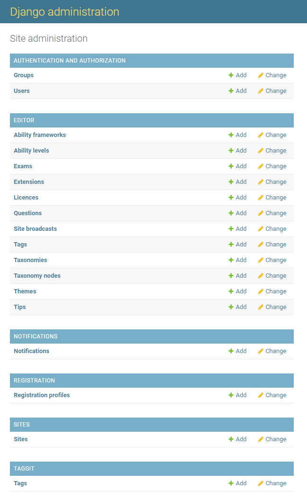
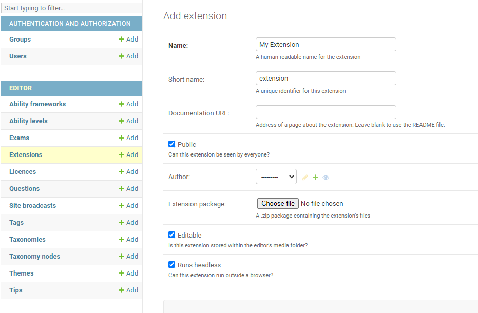
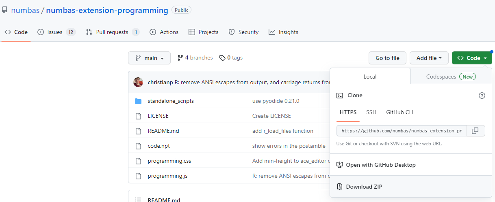

.. _admin-interface:

Using the admin interface
=========================
The admin interface can be accessed through ``/admin`` which opens the `Django <https://www.djangoproject.com/>`__ admin interface

Here, you can alter many options about the editor.

Installing extensions
---------------------

To install extensions directly to the editor, use the ``extensions`` tab. 
From here you can add new extensions or alter current ones. 

The name can be anything but the short name must match that used in the JavaScript file within the extension.

If you want the extension to be available to every user, tick the 'public' checkbox .

Select a user to be the author of the extension; this user will have full editing access.

Upload the extension package - this should at minimum contain a ``.js`` file matching the short name.

Upon saving the extension, it will become available for use within your editor.

Downloading extensions from GitHub
----------------------------------

The extension packages for first-party extensions can be obtained from the `Numbas page on GitHub <https://github.com/numbas?q=numbas-extension>`__

To obtain the package for an extension, click on the :guilabel:`Code` button and then :guilabel:`Download ZIP`. 
This can then be directly uploaded as above - ensure that the short name matches the ``.js`` in the package folder.

