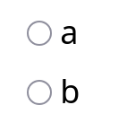
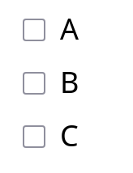

.. _custom-part-types:

Custom part types
*****************

.. image:: images/custom-part-type-editor.png
    :alt: The custom part type editor

Custom part types allow you to reuse marking algorithms you've written, while providing fields for the part's settings, like the built-in parts.

Creating a new part type
========================

To create a new custom part type, click on your user icon at the top of the page, and then :guilabel:`Profile`.
Once on your profile, click :guilabel:`Part types`, and then :guilabel:`Create a new part type`.

The first step is to pick a name for your part type.
It should concisely describe what the part type is for, ideally by describing how the student should answer it or how it is marked.
For example, "Give a root of a function" is a good name for a part type where the student has to provide a value which is mapped to zero by a function defined by the question author.

You can change the name of your part type later on if you need to.

The editing interface for custom part types is arranged similarly to the question and exam editors: the sections are separated into tabs, and you should work through them all in order to define how the part type works.

Description
===========

.. glossary::

    Name
        The name of the part type as it appears in the question editor. 
        It should concisely describe what the part type is for, ideally by describing how the student should answer it or how it is marked.
        For example, "Give a root of a function" is a good name for a part type where the student has to provide a value which is mapped to zero by a function defined by the question author.

    Description
        Use this field to describe how this part type works, and what kinds of questions it is appropriate for. 
        This text will appear in the list of part types on your profile, and in the public list if you make your part type public, to help question authors decide if the part type is right for their use.

    URL of documentation
        Use this field to provide a link to any more documentation about your custom part type.
        You might link to a blog post explaining what the part type is for, or a page giving more information on the theory behind the part type.

.. _custom-part-type-settings:

Required extensions
===================

If your part type requires functions from a Numbas extension, select it here.
Any questions using this part type will automatically load the required extensions.

Part settings
=============

Define setting fields to allow question authors to configure your part type.
They appear in the question editor's :guilabel:`Marking settings` tab for any parts of this type.

Each setting produces a JME value which can be used to set up the part type's :ref:`answer input <custom-part-type-answer-input>` and in the :ref:`marking algorithm <custom-part-type-marking>`.
There is a dictionary variable called ``settings`` with keys for each setting.
For example, a setting with name ``correct_answer`` will be available as ``settings["correct_answer"]``.

The following fields are common to all setting types:

.. glossary::

    Name
        A short name for this setting, used to refer to it in the part type's :ref:`answer input <custom-part-type-answer-input>` or :ref:`marking algorithm <custom-part-type-marking>`.
        The name should uniquely identify the setting, but doesn't need to be very descriptive - the label can do that.

    Label
        The label shown next to the setting in the question editor.
        Try to make it as clear as possible what the setting is for.
        For example, a checkbox which dictates whether an input hint is shown should be labelled something like "Hide the input hint?" rather than "Input hint visibility" - the latter doesn't tell the question author whether ticking the checkbox will result in the input hint appearing or not.

    Help URL
        The address of documentation explaining this setting in further depth.
        This is optional.

    Input hint for question author
        Use this field to give further guidance to question authors about this setting, if the label is not enough.
        For example, you might use this to say what data type a JME code setting should evaluate to.

    Default value
        The initial value of the setting in the question editor.
        If the setting has a sensible default value, set it here.
        If the value of the setting is likely to be different for each instance of this part type, leave this blank.
        (Not present for :guilabel:`Drop-down box` or :guilabel:`Choose one or more` 

Setting types
-------------

String
######

A string of text. 
If :guilabel:`Substitute values into text` is ticked, then JME expressions enclosed in curly braces will be evaluated and the results substituted back into the text when the question is run.
Otherwise, the string will be untouched.

Mathematical expression
#######################

A mathematical expression, in :ref:`JME` syntax.
If :guilabel:`Substitute variables into value?` is ticked, then JME expressions enclosed in curly braces will be evaluated and the results substituted back into the string.

This setting type produces a value of type :data:`expression`.

Checkbox
########

If the question author ticks the checkbox, this setting type produces ``true``, otherwise it produces ``false``.

Drop-down box
#############

The question author must pick one option from a list that you provide. 
The :guilabel:`Label` field is shown to the question author, and the setting produces the :guilabel:`Value` field as a string.

Choose one or more
##################

The choices are presented to the question author as a list, with a checkbox next to each label.
This setting type produces a list containing the :guilabel:`Value` fields of ticked choices, as strings.

If :guilabel:`Default on?` is ticked for a particular choice, that choice is selected when a new part of this type is created.

JME code
########

A code editing area for the question author to write a JME expression.

If :guilabel:`Evaluate?` is ticked, the expression will be evaluated when the question is run, and the setting produces the resulting value.
The evaluation happens inside the question's scope, so any variables and functions defined by the question author are substituted in before evaluation.

If :guilabel:`Evaluate?` is not ticked, this setting will produce a :data:`expression` value representing the question author's expression.

Percentage
##########

A sliding scale between 0% and 100%.

This setting type produces a number between 0 and 1.

HTML content
############

An HTML :ref:`content area <content-areas>`.

If :guilabel:`Substitute variables into value?` is ticked, then JME expressions enclosed in curly braces will be evaluated and the results substituted back into the text.

List of strings
###############

This setting type produces a list of strings entered by the question author.

If :guilabel:`Substitute variables into value?` is ticked, then JME expressions enclosed in curly braces in each string will be evaluated and the results substituted back in.

.. _custom-part-type-answer-input:

Answer input
============

The answer input method determines how the student enters their answer to the part.

The following fields are common to all input methods:

.. glossary::

    Expected answer
        A JME expression which evaluates to the expected answer to the part.

        Available in the marking algorithm as ``input_options["correctAnswer"]``.

    Input hint
        A string displayed next to the input field, giving any necessary information about how to enter their answer.

        If there are any requirements the student's answer must meet that aren't obvious from the way the input is displayed, for example a maximum length or required number of decimal places, these should be described here.

        Available in the marking algorithm as ``input_options["hint"]``.

Many of the fields can be either *static* or *dynamic*. 
A static field takes the same value in every instance of the part type.
A dynamic field is defined by a :ref:`JME` expression which is evaluated when the question is run.
You can use the part's settings in these expressions with the ``settings`` variable.

The values of input_options are available in the marking script under the :data:`input_options` dictionary.
In the tables below, the **Name** column gives the key in the dictionary corresponding to the option.

.. _custom-part-type-answer-input-methods:

Answer input methods
--------------------

.. _answer-input-method-string:

String
######

The student enters a single line of text.

.. csv-table:: Input options
    :header: "Label", "Name", "Data type", "Description"

    "Allow student to submit an empty string?", ``allowEmpty``, :data:`boolean`, "If ``false``, the part will only be marked if their answer is non-empty."

The answer is a :data:`string`.

.. _answer-input-method-number:

Number
######

.. image:: images/answer-widget-number.png
    :alt: The number input method as it appears to the student: a text input box which only accepts numbers.

The student enters a number, using any of the allowed notation styles.
If the student's answer is not a valid number, they are shown a warning and can not submit the part.

.. csv-table:: Input options
    :header: "Label", "Name", "Data type", "Description"

    "Allow fractions?", ``allowFractions``, :data:`boolean`, "Allow the student to enter their answer as a fraction?"
    "Allowed notation styles", ``allowedNotationStyles``, :data:`list` of :data:`string`, "The allowed :ref:`styles of number notation <number-notation>`."

The answer is a :data:`number`, as interpreted by :jme:func:`parsenumber`.
If the student's answer is not a valid representation of a number, the part will not be submitted.

If you wish to allow :ref:`number notation <number-notation>` styles other than those built-in, a string input is more appropriate, so you can parse the student's answer yourself in the marking script.

.. _answer-input-method-mathematical-expression:

Mathematical expression
#######################

The student enters a :ref:`JME` expression.

.. csv-table:: Input options
    :header: "Label", "Name", "Data type", "Description"

    "Show preview of student's answer?", ``showPreview``, :data:`boolean`, "If ``true``, a LaTeX rendering of the student's answer will be shown next to the input box."

The answer is an :data:`expression` value corresponding to the student's input.

If the student's answer is not a valid expression, the part will not be marked.

.. _answer-input-method-matrix:

Matrix
######

The student enters a two-dimensional array of values.

.. csv-table:: Input options
    :header: "Label", "Name", "Data type", "Description"

    "Allow student to change size of matrix?", ``allowResize``, :data:`boolean`, "If ``true``, the student can change the size of the matrix. Otherwise, it is fixed to the specified size."
    "Number of rows", ``numRows``, :data:`number`, "The initial number of rows in the input matrix."
    "Number of columns", ``numColumns``, :data:`number`, "The initial number of rows in the input matrix."
    "Parse cell values", ``parseCells``, :data:`boolean`, "If ``true``, the answer will be a :data:`matrix` of numbers. Otherwise, it is a 2-dimensional :data:`list` of lists of :data:`string` values."
    "Allowed notation styles", ``allowedNotationStyles``, :data:`list` of :data:`string`, "The allowed :ref:`styles of number notation <number-notation>`."
    "Allow fractions?", ``allowFractions``, :data:`boolean`, "Allow the student to enter numbers as fractions?"
    "Show brackets?", ``showBrackets``, :data:`boolean`, "If ``true``, parentheses are drawn on the left and right of the matrix."
    "Row headers", ``rowHeaders``, :data:`list`, "Text to show on the left of each row. One string for each row."
    "Column headers", ``columnHeaders``, :data:`list`, "Text to show above each column. One string for each column."

If ``parseCells`` is ``true``, the answer is a :data:`matrix` value corresponding to the student's input.
The part will not be marked unless all of the cells in the student's matrix are valid numbers.

If ``parseCells`` is ``false``, the answer is a :data:`list` of lists of :data:`string` values.

.. _answer-input-method-radio-buttons:

Radio buttons
#############

The student chooses one from a list of choices by selecting a radio button.

.. csv-table:: Input options
    :header: "Label", "Name", "Data type", "Description"
    
    "Choices",``choices``, :data:`list` of :data:`string`, "The labels for the choices to offer to the student."

The answer is the index of the student's choice in the list. 
The first item in the list is index 0.

The part will not be marked unless the student selects one of the choices.

.. _answer-input-method-choose-several:

Choose several from a list
##########################

The student chooses any number of items from a list of choices by ticking checkboxes.

.. csv-table:: Input options
    :header: "Label", "Name", "Data type", "Description"
    
    "Choices",``choices``, :data:`list` of :data:`string`, "The labels for the choices to offer to the student."

The answer is a :data:`list` of :data:`booleans` describing whether the student ticked the corresponding choice.

.. _answer-input-method-dropdown:

Drop-down box
#############

The student chooses one from a list of choices in a drop-down box.

.. csv-table:: Input options
    :header: "Label", "Name", "Data type", "Description"
    
    "Choices",``choices``, :data:`list` of :data:`string`, "The labels for the choices to offer to the student."

The answer is the index of the student's choice in the list. 
The first item in the list is index 0.

The part will not be marked unless the student selects one of the choices.

.. _custom-part-type-marking:

Marking
=======

The :guilabel:`Marking` tab is where you construct the :ref:`marking algorithm <marking-algorithm>` for your part type.

The interface is similar to that for :ref:`question variables <variables>` - a list of defined notes is shown on the right-hand side, and the currently selected note is shown on the left.

The two required notes, :data:`mark` and :data:`interpreted_answer`, can not be deleted.

.. glossary::

    Name
        The name of the note. 
        This must be a valid :ref:`JME variable name <variable-names>`.

    Definition
        A :ref:`jme` expression used to evaluate the note.

        See :ref:`the list of variables available in a marking script <marking-algorithm-variables>`, in particular :data:`studentAnswer`, :data:`settings` and :data:`input_options`.

    Description
        Describe what the note means, and how it is used.

        You should try to describe the value the note produces, as well as any feedback.

        .. note::
            Don't underestimate the value of the description field!
            Notes whose meaning seems clear when you write them have a habit of becoming indecipherable months later.

    Depends on
        A list of all notes used in this note's definition.
        You can click on a note's name to go to its definition.
        If the note hasn't been defined yet, it'll be created.

    Used by
        A list of all notes which use this note in their definition. 
        You can click on a note name to go to its definition.

Making sure that the marking algorithm works
--------------------------------------------

You must make sure that your part type will mark all possible answers that a student can enter.
Decide how you want to handle different kinds of "invalid" input - do you want to strip space characters from the student's answer, for example?
Use the :jme:func:`fail` function to stop the marking algorithm and force the student to change their answer before resubmitting, if the student's answer is of a form .
However, it's important not to reject plausible answers that are simply incorrect - you should make every effort to accept answers that follow the :term:`input hints <Input hint>` you've given.

There's no facility to test the marking algorithm inside the custom part type editor - for this, you need to create an instance of the part type inside a question so you can configure its settings.

When a student attempts a question using a custom part type, if any errors are encountered while evaluating your part type's marking algorithm, the student will be shown a generic error asking them to report the problem.
In order to see what the problem is, you'll have to reproduce the student's input in the question editor's :ref:`marking algorithm <part-marking-algorithm>` tab.
A more descriptive error message, detailing the note affected and the exact nature of the error, will be shown.

Access
======

Your custom part types are available only to you, and other members of projects you belong to.
If you've created a part type that could be useful to others, please consider publishing it.

Before a custom part type can be published, the following conditions must be met:

* The part type must have a name and a description.
* There must be at least one setting, and all settings must be complete.
* The expected answer and input hint must be set.
* The ``mark`` and ``interpreted_answer`` notes must be defined.

To publish a part type, click the :guilabel:`Publish` button in the :guilabel:`Access` tab.

You can unpublish a part type by clicking the :guilabel:`Unpublish` button. 
It will no longer be available to other users when creating new parts, but any instances of the part in existing questions will remain in place.

Examples
========

A question in the Numbas demo demonstrates a few custom part types.

`Numbas demo: custom part types <https://numbas.mathcentre.ac.uk/question/66287/numbas-demo-custom-part-types/>`_
