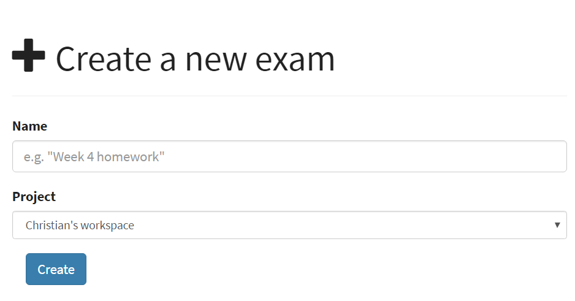
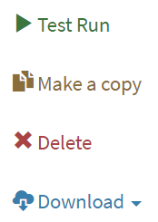
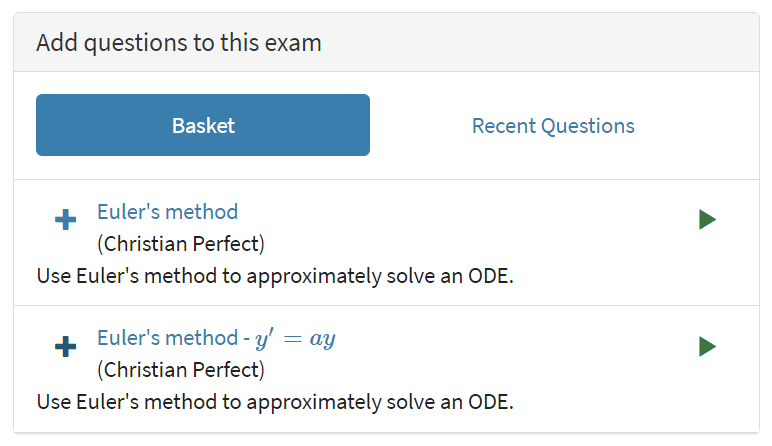
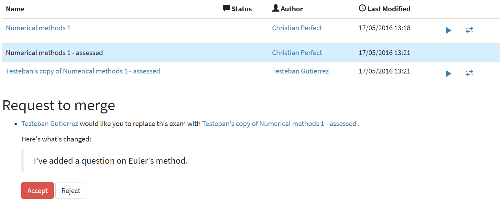

.. _exams:

Exams
*****

An exam is a collection of questions which you will give to your students. 
Within an exam you can set a pass mark, as well as configure how much feedback students can receive and how they can navigate between questions.

For a quick introduction to the workflow involved in putting an exam together, see the :doc:`tutorial on creating an exam </tutorials/create-exam>`.

Creating an exam
================

To create an exam from any page in the Numbas editor, click on the plus icon at the top of the page, and select :guilabel:`Exam`. 

You must give a name for your exam, and select a :doc:`project </project/reference>` for it to go in. 
The default project is your personal workspace; you can always move the exam to another of your projects later on.

The exam editor
===============

At the top of the exam editor is the exam's name, as well as a stamp showing the status of the exam.

Click on the status stamp to give feedback about the quality of an exam, after running it. 
The options are listed in descending order of "suitability for use":

* **Ready to use** - this exam is of sufficient quality to give to students.
* **Should not be used** - this exam works, but you deprecate its use - for example, if it's not intended for use by students, or there's a better version elsewhere.
* **Has some problems** - this exam works, but has some problems which mean it's not ready for use by students - for example, the exam is incomplete, or changes need to be made to the text. 
  Further work is needed before this exam can be given to students.
* **Doesn't work** - this exam doesn't even run!
* **Needs to be tested** - this exam looks alright to me, but it should be checked thoroughly before being used.

On the left of the screen are :ref:`exam-admin-controls` and labels for each of the editing tabs.

.. _exam-admin-controls:

Admin controls
==============

.. glossary::
    Run
        Opens a preview of the exam in a new window.

        .. warning:: 
            Do **NOT** use this link to deliver the exam to students. 
            This link is not permanent and could stop working at any time.
            Instead, download the exam and put it either on your own webspace or in a VLE.

    Make a copy
        Create a copy of the exam. 
        Use this to make changes to an exam which does not belong to you.

    Delete
        Delete the exam permanently from the database. 
        The associated questions are not deleted - you must delete them individually, if you want them to be deleted too.

    Download
        Links to download standalone packages of the exam. 

        * **SCORM package** - a compiled package of the exam with SCORM files included, so it can be uploaded to a VLE and communicate with its gradebook.
        * **standalone .zip** - a compiled package of the exam, ready to run anywhere without connecting to a VLE. 
        * **source** - a plain-text representation of the exam, to be used with the Numbas command-line tools or as a backup.

Questions
=========

Select the questions you want to include in your exam on this tab.

Questions are organised into groups.
For each group, you can decide how many of the available questions to show to the student, and the order they should appear.
You can use every question selected, or pick a random subset each time the exam is started.

.. glossary::

    Show group names to student?
        If this is ticked, the names you give to each group of questions will be shown to the student in the navigation menu when they run the exam, and in the score breakdown at the end of the exam.

    Shuffle question groups?
        If this is ticked, the question groups will be shown to the student in a random order.

    Questions to use
        The strategy for picking questions to show to the student.

        * **All questions, in this order** - all of the questions in the list below are shown to the student, in the order you've chosen.
        * **All questions, in random order** - all of the questions in the list below are shown to the student, in a different order for each attempt.
        * **Pick a random subset** - A subset of the questions in the list below are shown to the student. 
          The questions chosen, and the order they appear, will differ for each attempt.

    Number of questions to choose
        If using the "Pick a random subset" strategy, this many questions from this group will be shown to the student.

Click :guilabel:`Add a question to this group` to add a question to the current group.

* The :guilabel:`Basket` tab shows questions you've added to your basket: you can browse the question editor to find questions, add them to your basket, and then go back to the exam editing page and add them in.
* The :guilabel:`Recent questions` tab shows questions you have recently edited.

You can check a question does what you want and give it a test run before including it in your exam: click on the question's name to open its editing page in a new window.

Click the plus icon on one of the question results to add it to your exam. 

You can drag and drop questions in the list on the left to reorder them, or move them between groups.

The :guilabel:`Replace this question with a copy` lets you quickly swap in a duplicate of a question you've included in your exam. 
If you're using a question created by someone else, this is a convenient way of getting a version of the question you can make changes to.

If the question has any :term:`variables whose values can be overridden <Can an exam override the value of this variable?>`, then you can give values for those variables here.
The :guilabel:`Value` field should contain a :ref:`JME` expression for the desired value of the variable.

.. note:: 

    Removing a question from an exam does not remove it from the database.
    To permanently delete a question, click on its name to open its edit page, and click the :guilabel:`Delete` button there.

Display
=======

.. glossary::

    Interface theme
        Themes control the user interface of an exam, changing the look and feel. 
        The `default` theme is designed for exams which will be delivered over the web. 
        There is also a `worksheet` theme which can be used to print out multiple, randomised copies of an exam for students to complete on paper.

    Interface language
        Specify which translation to use for the text in the user interface, i.e. button labels, error messages, etc.

    Allow students to print question content?
        If this is turned off, all questions will be hidden when the exam is printed.
        If a student tries to print during an exam, they will see nothing.
        If they try to print a completed exam, they will only see the results summary screen.

Navigation
==========

The navigation settings control how the student can move through the exam.

.. glossary::
    Password to begin the exam
        If not blank, the student must enter the given password before they can begin the exam.

    Allow user to regenerate questions?
        If ticked, then the :guilabel:`Try another question like this one` button is displayed at the bottom of each question, allowing the student to re-randomise the question and have another attempt at it.

    Question navigation mode
         If "Sequential" is chosen, then the student is shown the questions in a numbered list.
         When the exam begins, the student is immediately shown the first question.

         If "Choose from a menu", the student is shown a menu listing all the available questions.
         They can click on a question to view it, and can go back to the menu at any time.
         Use this mode to provide a bank of questions for students to pick and choose from.
         There are no :guilabel:`End exam` or :guilabel:`Pause` buttons - this mode is intended for purely formative use.
         When the exam begins, the student is shown the menu.

    Allow move to previous question?
        If ticked, then the user is allowed to move back to a question after leaving it.

    Allow jump to any question?
        If ticked, then the user can jump between questions at will during the exam.

    Enable steps?
        If unticked, then part steps will not be offered to the student, regardless of whether any have been defined in the exam's questions.

    Show front page?
        If ticked, then an intro screen is shown to the student before the exam starts, 

    Reveal answers to all questions
        Control when the student may see the results page, after ending the exam.
        
        If :guilabel:`On completion` is chosen, the results page will be shown immediately after the student ends the exam, and when they re-enter in review mode.

        If :guilabel:`When entering in review mode` is chosen, on ending the exam the student will just be shown a screen directing them to exit. When they re-enter the exam in review mode, they will be shown the results page.

        If :guilabel:`Never` is chosen, the student will never be shown the results page, even when entering in review mode.

        When an instructor opens a student's attempt, they are always shown the results page. (This feature only works in the Numbas LTI provider, not in a generic SCORM player)

    Confirm before leaving the exam while it's running?
        If ticked, the student will be asked to confirm that they really want to leave if they try to close the exam while it's running, for example by pressing the browser's back button or closing the tab the exam is running in.

    On leaving a question
        What to do when the student changes question, or tries to end the exam. 
        You can either warn the student and make them confirm that they'd like to leave, or prevent them from leaving the question entirely until they've answered it.

Timing
======

.. glossary::
    Exam duration
        The length of time students are allowed to attempt the exam. 
        If set to zero, then there is no time limit.

    Allow pausing?
        If ticked, the student can pause the exam while running it, and the timer will stop. 
        If unticked, there is no pause button, and the end time is fixed when the session starts - leaving and resuming through the VLE will not affect the end time.

    On timeout (event)
        If set to :guilabel:`Warn`, the given message is displayed when the student runs out of time.

    5 minutes before timeout (event)
        If set to :guilabel:`Warn`, the given message is displayed five minutes before the student runs out of time.

.. _exam-feedback:

Feedback
========

.. glossary::
    Show current score?
        If ticked, the student will be shown their score for each question and part immediately after submitting their answers.

    Show maximum score?
        If ticked, the student will be shown the maximum attainable score for each question and part.

    Show answer state?
        If ticked, then when the student submits an answer an icon will be displayed to let the student know if their answer was marked correct, partially correct or incorrect, and feedback messages will be displayed underneath.

    Allow reveal answer?
        If ticked, then the :guilabel:`Reveal answer` button is enabled on each question. 
        If the student chooses to reveal the answer to a question, they are shown the correct answer but lose all their marks and can not re-attempt the question.

    Show student's name?
        If ticked, the student's name is shown on the results page after the exam has finished.
        The student's name is only available when running the exam through a VLE - exams run standalone do not know the student's name.

    Pass threshold
        Define a pass/fail threshold for the student's total score, as a percentage of the available marks.
        The pass/fail message will be displayed when the student ends the exam. 
        If this is set to zero, then no message is displayed.

    Introduction
        This text is shown to the student on the front page, before the exam starts. 
        You could use it to outline the rules of the exam, or just summarise the subjects covered.

    Feedback messages
        You can write a list of messages, paired with threshold percentages, to show to the student at the end of the exam.
        The student's score is calculated as a percentage, rounded to the nearest 1%, and compared with the thresholds for each message.
        The message with the largest threshold less than or equal to the student's score is displayed.

        You could use these messages to suggest topics for the student to revise, direct them to support resources, or detail the consequences of failing the test.

.. _review-mode-options:

Review mode
-----------

The following settings apply to review mode: when a student has finished the exam, and goes back to review their attempt.

.. glossary::
    Show score in review mode?
        If ticked, then in review mode (after the exam has finished) the student will be shown their score for each part, each question and the whole exam.
        If not ticked, the student will not be shown their score, or icons related to the score, in review mode.
        Ticking this does not override the :term:`Show score feedback icon?` setting for individual parts.

    Show part feedback messages in review mode?
        If ticked, then in review mode the student will be shown feedback messages for each part.

    Show expected answers in review mode?
        If ticked, then in review mode the expected answer for each part will be shown next to the student's answer input.
        Ticking this does not override the :term:`Show correct answer on reveal?` setting for individual parts.

    Show question advice in review mode?
        If ticked, then the advice section will be displayed under each question in review mode.
        If not ticked, the advice will never be shown.

Events
======

Some of the properties described above are marked as *events*. 
These all have the same structure: an :guilabel:`action` setting which determines how to react to the event, and a :guilabel:`message` to display to the student when appropriate.

Settings
========

The settings tab is where you set up metadata describing the exam.

Try to make sure not to ignore the settings tab, even if you just want to get a working exam as quickly as possible - a good name and description will make it much easier to find your exam again in the future!

.. glossary::
    Name
        This is shown to the student and used for searching within the editor, so make it something intelligible. 
        "Linear algebra diagnostic test" is a good name; "L.A. t1 v1" is not.

    Description
        Use this field to describe the exam's contents, what it assesses, and so on. 
        This is shown in the exams index, so make sure it's fairly concise.

    Tags
        Use tags to categorise exams so they can be found through the search function. 
        Your guiding principle should be "more is better" - try to write down all words that someone searching for this exam might use.

        After typing a tag in the box, press the :kbd:`Enter` key to add it to the list.

Metadata
--------

.. glossary::

    Transfer ownership
        Click this button to transfer ownership of the exam to somebody else.
        You will be given editing access automatically, but the new owner can revoke this.

    Move to another project
        Click this button to move the exam to another project.
        You can move an exam to any project to which you have editing access.

    Licence
        You can specify the licence under which you are making your resources available. 
        Different licences allow other users to copy, modify or reuse your content in different ways - consider which licence to choose carefully. 
        *CC BY* allows other users to reuse your content however you like, as long as they give appropriate credit to you.

    Subjects and Topics
        The :guilabel:`Subjects` and :guilabel:`Topics` fields provide a more structured way to categorise exams according to the subjects they assess.
        Database search results can be filtered by subject or topic.

        Once you have selected one or more subjects, topics belonging to those subjects appear underneath.

        The options for these fields are defined by the server administrator.

    Ability levels
        Use this field to describe which ability levels the exam is appropriate for.

        Several *ability frameworks* are available to choose from - pick the framework which most closely matches your own, and select one or more ability levels.
        An ability level is modelled as an interval in the range 0 to 1, so when you filter database search results by ability level, any items whose ability levels overlap the ones you selected are included in the results.

        The options for these fields are defined by the server administrator.

Access
======

You can control who is allowed to see, and to edit, your exams.

When you create a new exam, access is limited to you and any other members of the project the exam belongs to.
You can grant extra access to indvidual users or *publish* your exam to the public database, where it can be viewed by any other user.

.. topic:: Give access to a user

    Type a name into the search box to find a user. 
    Click on a user's name in the results list to add them to the access list. 

    Named users can have the following rights:

    .. glossary::

        Can view this
            The named user can see, but not edit, this exam.

        Can edit this
            The named user can see this exam and make changes to it.

.. topic:: Access Links
    
    The URLs in this section automatically grant access to whoever follows them. 
    You could use these links to share a question with someone who hasn't yet created an account on the editor (they'll be prompted to create an account when they click on the link), or to share a question with a group of people without inviting each person individually.

    .. warning::
        These URLs grant access to whoever clicks on them, so be careful about how they're shared.

Other versions
==============

In this tab you can see all exams which are related to this one. 
Exams are related if one is a copy of the other, or they are both copies of a common ancestor.
You can use this tab to compare the current exam with related versions, and offer to merge your version of the exam into another.

Click on the :guilabel:`Compare` link to go to a screen where you can offer to replace the other version with your version, or vice versa.
If you have editing access to the destination exam, you can replace it with the other version automatically.
If you don't have editing access, the owner of the exam will be sent a *Request to merge*, which they must accept before the exams are merged.

Before creating the request, you'll be asked to describe how your version differs from the one you want to replace.
Try to sum up all your changes - this will show up in the exam's editing history if your request is accepted.

.. warning::
    If the exam you want to replace has changed since you made a copy of it, those changes will be lost if the request to merge is accepted - the exam is completely overwritten with the new version. 

    You can always restore an old version of an exam after a merge, by clicking on the appropriate :guilabel:`restore` link in the :guilabel:`Editing history` tab.

Active requests to merge other versions into the current exam are shown underneath the list of related versions.
You can :guilabel:`accept` the request, in which case your version will be replaced with the other version, or :guilabel:`reject` it, in which case your version will be unchanged and the person who made the request will be notified that it was rejected.

Editing history
===============

Use this tab to keep a record of changes made to your exam.
Write comments to discuss problems or suggested changes.

The :guilabel:`Contributors` list shows everyone who has made a change to this exam.
This list is included with the exam when you :term:`download` it, and if you re-upload this exam to an instance of the Numbas editor.

Each time you make a change to an exam, it's saved to the database. 
To save a snapshot of the current state of the exam, click the :guilabel:`Set a checkpoint` button.
You'll be asked to write a description of the exam as it stands - describe what you've changed since the last snapshot, and why you're making a snapshot.

To restore a checkpoint, click its :guilabel:`Restore` button. 
The current state of the exam will be overwritten with the saved state.

Other activity on this exam will also be shown in this tab: for example, each time somebody uses the :guilabel:`Feedback` button to provide feedback on this exam, an entry is added to the editing history.
