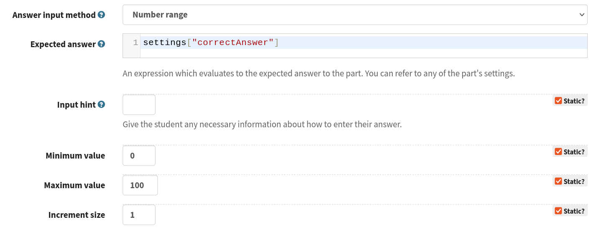

.. _writing-extensions:

Writing an extension
====================

Creating a new extension
------------------------

To begin writing an extension from scratch, click on the :guilabel:`Profile` link, then :guilabel:`Extensions`.

Click the :guilabel:`Create a new extension` button.
On the following page, enter a name for your extension and click :guilabel:`Submit`.
Note that the extension's name must be unique among all extensions in the database, so you might need to change your chosen name if someone else has already used it.

You will then be presented with the editor for the extension's main script file.

Uploading an extension
----------------------

The :guilabel:`Upload an extension` link takes you to a form where you can upload your extension.

Either upload a single JavaScript file, or a .zip file containing all of the extension's files.

After uploading your extension, you will be presented with the editor for the extension's main script file.

.. glossary::
    Name:
        A human-readable name for the extension.
        This should concisely describe what it does, or what feature it provides.

    Short name:
        A unique identifier for the extension.

        .. warning::
            An extension's short name must be **unique**, and match the short name used when uploading it to the editor.
            This means that if you reuse an extension and use a different name when uploading it to the editor, you must rename its JavaScript file and change the name given to ``Numbas.addExtension``.

    Documentation URL:
        The URL of a page describing how to use the extension.
        If this isn't used, then any ``README`` file in the extension package will be used.

Editing an extension
--------------------

To edit an existing extension, click the corresponding link in the list of extensions either in the question editor or in your profile's :guilabel:`Extensions` page.

The editor allows you to edit text files in the extension package.
After making changes, click the :guilabel:`Save` button.
If you've got a question which uses the extension open in another tab, you'll have to reload it before changes take effect.

Access to extensions
--------------------

An extension you create is initially only available to you.
You can grant access to other named users under the :guilabel:`Access` tab in the extension editor.

You can give other users the ability to *view* your extension, which will allow them to use the extension in their own questions, or the ability to *edit*, which will also allow them to edit the extension's source code.

Contents of an extension
------------------------

.. highlight:: javascript

The minimum an extension must contain is a file named ``<extension-name>.js``, containing the following::

    Numbas.addExtension('<extension-name>',['base'],function(extension) {

    });

(See the API documentation for `Numbas.addExtension <https://docs.numbas.org.uk/runtime_api/en/latest/Numbas.html#.addExtension>`_ for details on how this function works)

This function call tells Numbas that the extension has loaded.
Because Numbas can't guarantee the order script files will be loaded in, code which uses the `Numbas` object must be placed inside the callback function given to ``Numbas.addExtension``.

An extension can also include CSS files, which will be added to the rest of the Numbas CSS when an exam using the extension is compiled.
Any other file types are included in the compiled package as-is, under the path ``extensions/<extension-name>``. 

It's also a good idea to include documentation on how to use your extension in a ``README`` file.
Extensions created through the editor automatically have a ``README.md`` file, which is written in `Markdown <https://www.markdownguide.org/>`_ format.

Adding JME functions
--------------------

An extension can add JME functions (or rulesets, or anything else that goes in a `Scope <https://docs.numbas.org.uk/runtime_api/en/latest/Numbas.jme.Scope.html>`_ object by manipulating the ``extension.scope`` object.
Here's an example which adds a single JME function::

    Numbas.addExtension('difference',['jme'],function(extension) {
        var funcObj = Numbas.jme.funcObj;
        var TNum = Numbas.jme.types.TNum;

        extension.scope.addFunction(new funcObj('difference',[TNum,TNum],TNum,function(a,b){ return Math.abs(a-b); }, {unwrapValues:true, random: false}));
    })

The ``random`` attribute specifies whether the function behaves randomly or not.
The editor uses this to show variable definitions that introduce randomisation, and the runtime uses it to determine which variables can be deterministically re-calculated from their definitions.

(Download this extension: :download:`difference.zip <_static/difference.zip>`)

Adding a new JME data type
--------------------------

JME data types are JavaScript objects, distinguished by their ``type`` property.
The object should have a `value` property which contains the data it represents.
The JME system can happily use new data types, but you'll need to tell it how to render them as LaTeX or JME code.
This is done by adding methods to ``Numbas.jme.display.typeToTeX`` and ``Numbas.jme.display.typeToJME``.
Once you've defined how to create and display the new data type, you can add functions dealing with it in the same way as for the built-in data types.

Here's an example extension which defines a toy "chemical" data type (excuse the bad chemistry)::

    Numbas.addExtension('chemicals',['jme','jme-display'],function(chemicals) {

        var chemicalsScope = chemicals.scope;

        // Define the constructor for a new data type representing a chemical formula
        // `formula` is a dictionary mapping element symbols to the number of atoms present
        function TChemical(formula) {
            this.value = formula;
        }
        TChemical.prototype.type = 'chemical';

        // define a couple of example formulas
        chemicalsScope.variables.oxygen = new TChemical({O:2});
        chemicalsScope.variables.water = new TChemical({H:2, O:1});

        // Code to render a chemical formula as LaTeX
        Numbas.jme.display.typeToTeX.chemical = function(thing,tok,texArgs,settings) {
            var out = '';
            for(var element in tok.value){
                out += element;
                var num = tok.value[element];
                if(num>1) {
                    out += '_{'+num+'}';
                }
            }
            return '\\mathrm{'+out+'}';
        }

        // Code to render a chemical formula as a JME expression
        Numbas.jme.display.typeToJME.chemical = function(tree,tok,bits,settings) {
            var out = '';
            for(var element in tok.value) {
                if(out.length) {
                    out += '+';
                }
                out += 'molecule("'+element+'",'+tok.value[element]+')'
            }
            return out;
        }

        var funcObj = Numbas.jme.funcObj;
        var TString = Numbas.jme.types.TString;
        var TNum = Numbas.jme.types.TNum;

        // define addition on chemicals: add up the elements in each formula
        chemicalsScope.addFunction(new funcObj('+',[TChemical,TChemical],TChemical,function(c1,c2) {
            var nformula = {};
            var element;
            for(element in c1) {
                nformula[element] = c1[element];
            }
            for(element in c2) {
                if(element in nformula) {
                    nformula[element] += c2[element];
                } else {
                    nformula[element] = c2[element];
                }
            }
            return nformula;
        }));

        // define a function to create a molecule with given number of atoms of given element
        chemicalsScope.addFunction(new funcObj('molecule',[TString,TNum],TChemical,function(element,numatoms) {
            var formula = {};
            formula[element] = numatoms;
            return formula;
        }));

        // define a JME functions which tells you how many of the given element are in a formula
        chemicalsScope.addFunction(new funcObj('numatoms',[TChemical,Numbas.jme.types.TString],Numbas.jme.types.TNum,function(chemical,element) {
            if(element in chemical) {
                return chemical[element];
            } else {
                return 0;
            }
        }));
    });

(Download this extension: :download:`chemicals.zip <_static/chemicals.zip>`)

Adding a new answer input method
--------------------------------

You can define a new :ref:`answer input method <custom-part-type-answer-input>` to be used by :ref:`custom part types <custom-part-types>`.

An input method is the widget that the student interacts with to enter their answer.
For many part types this is a text box; for the multiple response part types it's checkboxes or radio boxes.

When none of the built-in input methods is suitable, you can define a new one in an extension.

To register an input method, in your extension's code call the function ``Numbas.answer_widgets.register_custom_widget`` with an object containing the following properties:

``name``
  A unique name for the widget. 
  Custom part types using the widget will refer to it by this name, so if you change it then any part types using it will need to be updated.
``niceName``
  A readable name to show in the editor.
``widget`` 
  A function to construct the widget (described below).
``signature``
  The :ref:`type of JME value <jme-data-types>` produced by the widget.
``answer_to_jme``
  A function which takes a value produced by the widget, and returns a JME token.
``options_definition``
  A list of options for the widget, which can be set by a custom part type.
``scorm_storage``
  Functions to save and load answers entered into this widget.

The function to construct the widget takes the following arguments:

``element``
  The HTML element that the widget should be attached to.
``part``
  The question part object that the widget belongs to.
``title``
  A string to use as the ``title`` attribute for the widget, if possible.
  This title is read out by assistive technology to describe the purpose of the widget, so it's important to use it.
``events``
  A dictionary of callback functions to call in response to events on the widget.
  The default theme uses the ``blur`` and ``focus`` events to control whether warning messages are displayed.
``answer_changed``
  A function to call when the answer entered into the widget changes. 
  It should be called with an object containing properties ``valid`` and ``value``: ``valid`` is a boolean representing whether the value can be marked, and ``value`` is the answer itself.
``options``
  A dictionary of options for the widget, corresponding to the options defined when the widget was registered.

Defining options
################

A widget can have as many options as you like.

One option is always defined: ``hint``, a string giving a hint to the student on how to enter the answer.

The ``options_definition`` list contains objects with the following properties:

``name``
  A name for the option, which will be used in the ``options`` parameter sent to the widget code.
``label``
  A readable name for the option, to show in the editor.
``input_type``
  The type of the option.
  This determines how the option is displayed in the editor, and the type of value it produces.
``default_value``
  The default value for the option.
``hint``
  Some text to help part type authors, describing how the option is used and kind of values it should take.
  This is optional - if the label gives enough information, you can omit the hint.
``data``
  Some input types need extra information, contained in this object.

The following types of option are available:

``string``
  A short text string.
``percent``
  A number between 0 and 100.
``mathematical_expression``
  Some JME code. 
``checkbox``
  A :data:`boolean` value, set in the editor by a checkbox.
``dropdown``
  Choose one from a list of string options.
  The ``data`` object must contain a property ``choices``, a list of objects of the form ``{value, label}``.
``code``
  A long text string.
  In the editor, this is presented in a code editor.
``html``
  A string of HTML.
  In the editor, this is presented in a rich-text editor.
``choose_several``
  A list of options, each of which can be selected or not.
  The ``data`` object must contain a property ``choices``, a list of objects of the form ``{value, label}``.
  This type of option produces a list of the selected ``value`` strings.
``list_of_strings``
  A list of short text strings.
``choice_maker``
  A list of short text strings, presented in the editor as an editable list of choices.
``number_notation_styles``
  A list of number notation styles.
  In the editor, this is displayed as a list of checkboxes associated with each number notation style.

Example
#######

.. figure:: images/range-widget.png
   :alt: A question part with prompt "Pick a number between 0 and 100" above a range widget positioned at 5.
   
   A part using the input method defined in this example.

   Configuring the input method in the custom part type editor.

Here's an example which defines an input method where the student has to pick a number from a range:

.. code-block:: javascript

    function RangeWidget(element, part, title, events, answer_changed, options) {
        var w = this;
        this.part = part;
        var container = document.createElement('div');
        element.appendChild(container);
        var input = this.input = document.createElement('input');
        container.appendChild(input);
        var display = this.display = document.createElement('span');
        container.appendChild(display);
        this.answer_changed = answer_changed;
        input.setAttribute('type','range');
        input.setAttribute('title',title);
        input.setAttribute('min',options.min);
        input.setAttribute('max',options.max);
        input.setAttribute('step',options.step);
        for(var x in events) {
            input.addEventListener(x,events[x]);
        }
        input.addEventListener('input',function(e) {
            w.update_display();
            answer_changed({valid: true, value: input.value});
        });
        this.update_display();
    }
    RangeWidget.prototype = {
        setAnswerJSON: function(answerJSON) {
            this.input.value = answerJSON.value;
            this.update_display();
        },
        disable: function() {
            this.input.setAttribute('disabled',true);
        },
        enable: function() {
            this.input.removeAttribute('disabled');
        },
        update_display: function() {
            this.display.textContent = this.input.value;
        }
    }
    
    Numbas.answer_widgets.register_custom_widget({
        name: 'range',
        niceName: 'Number range',
        widget: RangeWidget,
        signature: 'number',
        answer_to_jme: function(answer) {
            return new Numbas.jme.types.TNum(answer);
        },
        options_definition: [
            {
                name: 'min',
                label: 'Minimum value',
                input_type: 'string',
                default_value: '0'
            },
            {
                name: 'max',
                label: 'Maximum value',
                input_type: 'string',
                default_value: '100'
            },
            {
                name: 'step',
                label: 'Increment size',
                input_type: 'string',
                default_value: '1'
            }
        ],
        scorm_storage: {
            interaction_type: function(part) { return 'fill-in'; },
            correct_answer: function(part) { return part.input_options().correctAnswer; },
            student_answer: function(part) { return part.studentAnswer; },
            load: function(part, data) { return data.answer; }
        }
    });
