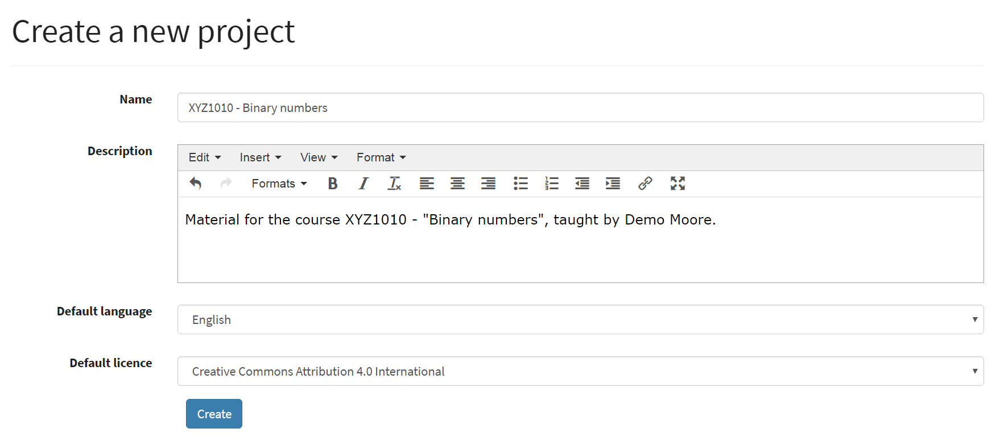
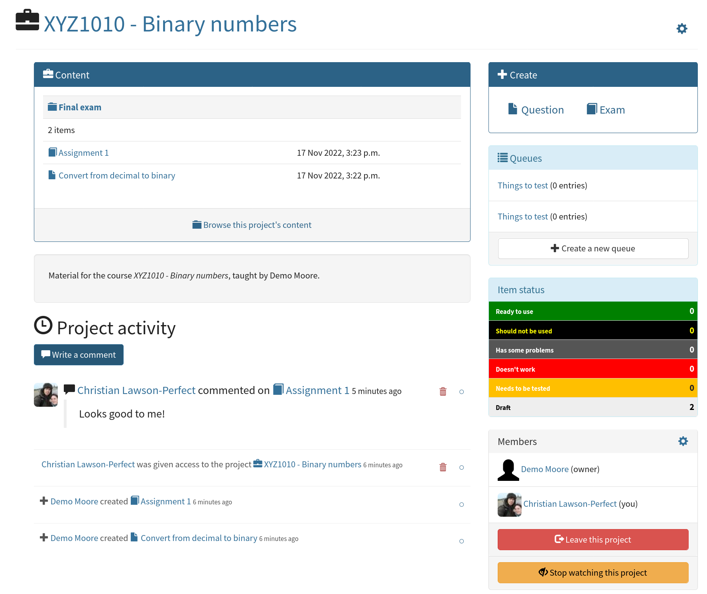
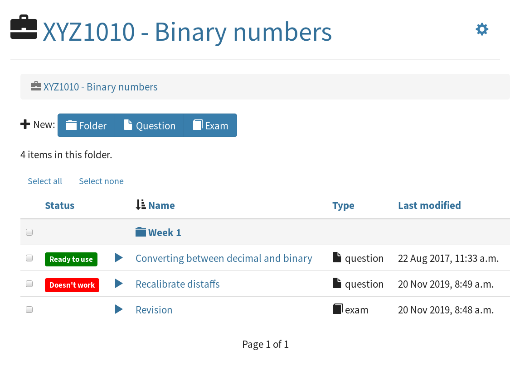
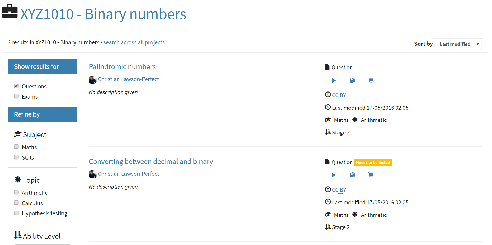
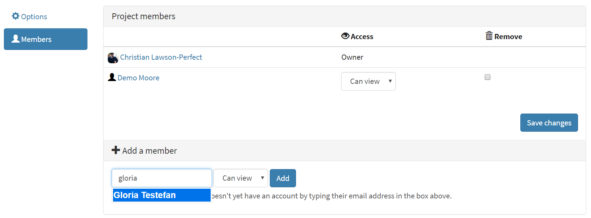
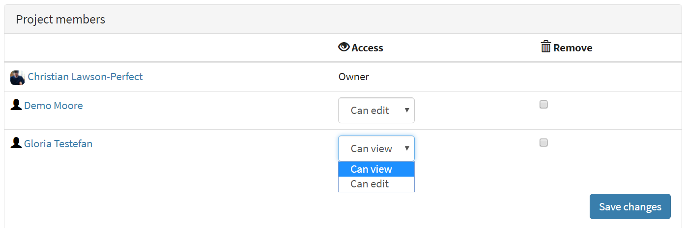

.. _projects:

Projects
********

Projects provide a way of collecting together all your work on a particular topic or course, and automatically granting access to your collaborators.

In the Numbas editor, every exam or question must belong to a single project. 
Your account always has one project attached to it - your workspace.
When you create a new exam or question, you'll be asked which project you want to attach it to, and the default option is your workspace.

If you're putting together content for a course you're teaching, it's a good idea to create a new project as a single gathering point for your material. 
A project is effectively a "fenced off" area of the editor where you can concentrate on just the material you want to work on, without having to wade through unrelated items.

Creating a new project
======================

Click on the :guilabel:`New` button at the top of the page, and then on :guilabel:`Project`.
You need to give some information about your new project:

* **A name for the project.**
  This should succinctly describe what the project is for, or what it contains.
* **A longer description of the project.** 
  You could include a link to your course homepage, or some information about the aims of the project.
* **A default language for content created in this project.**
  Any new exams created in this project will use this language by default.
* **A default licence for content created in this project.**
  Any new exams created in this project will have this licence attached by default.

The project home page
=====================

A project's home page shows a *timeline* of activity on the project, the list of members, review queues belonging to the project, and links to create new content or browse the project's existing content.

The timeline shows all activity on exams or questions belonging to the question, as well as comments attached to the project itself.
Timeline items belonging to each project you're a member of will also be shown in your personal timeline on the editor homepage.

The cog icon at the top of the page takes you to the project's options page. 
On this page you can change any of the project's settings or, if you're the project's owner and it isn't your personal workspace, delete it.

Organising content inside a project
===================================

From the project homepage, click on the :guilabel:`Browse this project's content` link to see the questions and exams belonging to the project. 

You can organise content into folders.

Click the :guilabel:`New folder` button to create a folder.
You can drag and drop items into folders, or select several items by ticking the checkboxes and then click the :guilabel:`Move selected items` button.

You can also search within a project by entering a query in the search bar at the top of the page.

Project settings
================

Click on the cog icon at the top-right of the page to change a project's settings.

.. _public-project:

If :guilabel:`Visible to non-members?` is ticked, the project and all of its **published** content will be visible to the general public.

Adding someone to a project
===========================

From the project's homepage, click on the settings icon at the top of the list of members to go to the member settings page. 
In the :guilabel:`Add a member` box, type the name of the person you want to invite.
If they don't have an account yet, their email address; they'll get an email asking them to create an account and when they do, they'll be given access to your project immediately.

You can control what project members are allowed to do: if you select :guilabel:`Can view` then the user will be able to look at, comment on, and download all content in the project, but not change anything. 
If you select :guilabel:`Can edit`, then they will also be able to create new content or change existing content.
You can also give project members access to individual exams or questions using the access controls on their respective edit pages.

Changing or removing a project member's access
==============================================

From the project's homepage, click on the settings icon at the top of the list of members to go to the member settings page. 

Change a project member's access rights by selecting an option from the dropdown next to their name.

To remove a user from the project, tick the checkbox corresponding to their name, then click the :guilabel:`Save changes` button.

Transferring ownership of a project to someone else
===================================================

The owner of a project has certain privileges which no other user does, such as deleting the project. 

To transfer ownership of a project to somebody else, go to the :guilabel:`Members` settings page and click on the :guilabel:`Transfer ownership` button, then enter the name of the person you'd like to transfer ownership to.
That user will become the owner of the project, and you will be given editing access to the project. 

Deleting a project
==================

To delete a project, you must be its owner.
You can't delete your personal workspace.

.. warning::
    Only delete a project if you're absolutely sure you don't need it any more.
    Deleting a project is an irreversible action that will result in the loss of data belonging to the project. 

To delete a project, go to the project's :guilabel:`Options` page and click on the :guilabel:`Delete this project` button.

Questions and exams belonging to the project will be reassigned to their authors' personal workspaces, but any comments on the project's activity timeline will be deleted.

.. _item_queues:

Queues
======

.. admonition:: Warning

   Queues are an experimental feature.

   The functionality and interface may change significantly in the next few months.

Queues offer a means of organising the editing process for content in a project.

You might use queues to:

* Manage the testing process for newly-written questions.
* Moderate submissions to a public library of content. (The Numbas Open Resource Library is one example of this)
* Assign particular tasks to different members of a team.

Users can submit questions or exams from anywhere in the editor into a queue, where it should be reviewed by members of the project.

Each queue has a "checklist" of criteria that reviewers should check for each submitted item, and a comments thread for discussing the submission.

Nothing automatic happens when an item is submitted to a queue, or when the submission is marked "complete" - it's just a tool to help you keep track of administrative processes.

Anyone with editing access to a project can create a queue, or edit an existing queue.
Anyone with viewing access to a project can see all of its queues, and any submissions to them.

You can also grant individual users who are not members of the project editing or viewing access to particular queues.

Creating a queue
----------------

On the project's homepage, click :guilabel:`Create a new queue`.

You need to give some information about the queue:

* **A name.**

* **A description.** 
  This will be shown on the queue's index page. 
  You could describe the purpose of the queue, and link to related documentation.

* **Instructions for submitters.**
  These will be shown to users when they submit an item to the queue.
  You should describe the criteria for inclusion in the queue.
  Submitters will not see the queue's checklist during submission.

* **Instructions for reviewers.**
  These will be shown to anyone with editing access to the queue when looking at a submission.
  You could give more detail on the criteria in the checklist, and describe any actions a reviewer should take during the review process.

* **A checklist.**
  A list of single-line items that reviewers should check for each submitted item.
  Each item in the list is initially unticked, and can be ticked by anyone with editing access to the queue.

Submitting an item to a queue
-----------------------------

Anyone with viewing access to a queue, or the project it belongs to, can add an item to it.

You can either start a submission by clicking the :guilabel:`Add an item to this queue` button on a queue's homepage, or by clicking the :guilabel:`Add to a queue` button in search results or in the exam and question editors.

When adding an item to a queue, you can write a note giving any information that the reviewers may find useful.

Reviewing a submission
----------------------

When reviewing a submission, you are shown a link to the item being submitted, the instructions, the checklist, and the comments thread.

You can tick or untick some or all of the items on the checklist.
To remove the item from the queue, tick :guilabel:`This entry is complete - remove it from the queue` before clicking :guilabel:`Save`.

Comments made on a submission are shown to anyone with viewing access to the queue.
The person who submitted the item and anyone else who has commented it are notified about each new comment.
