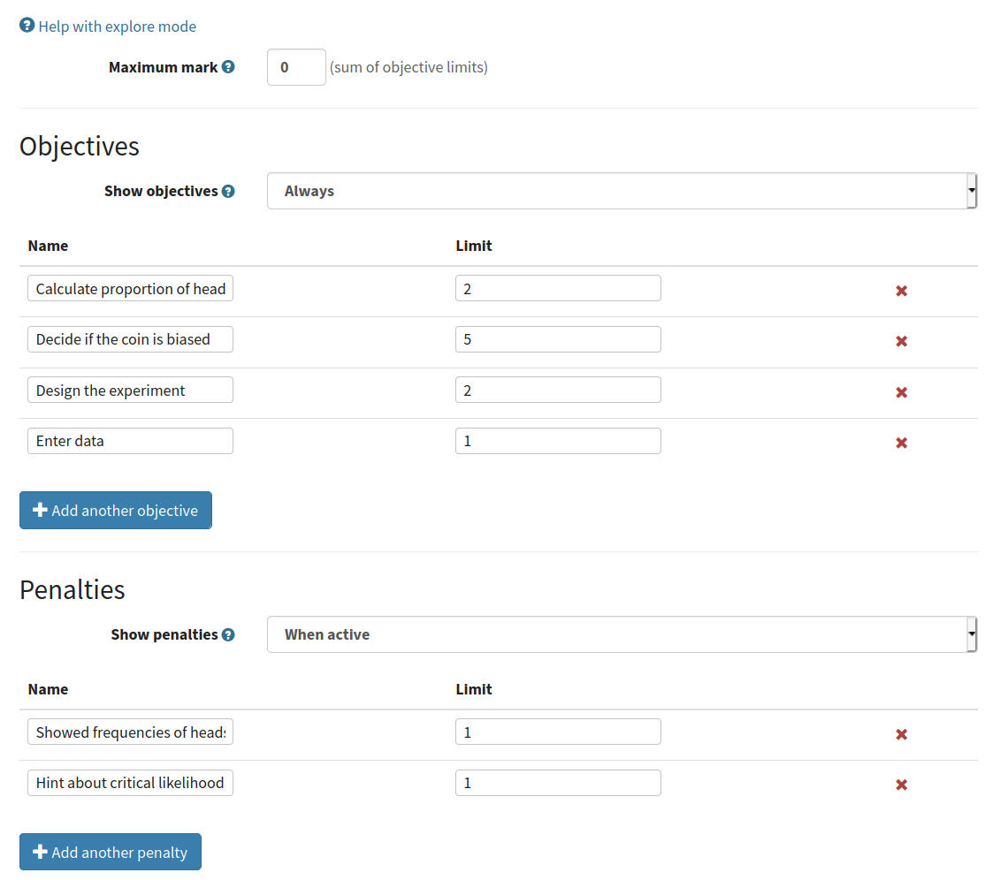
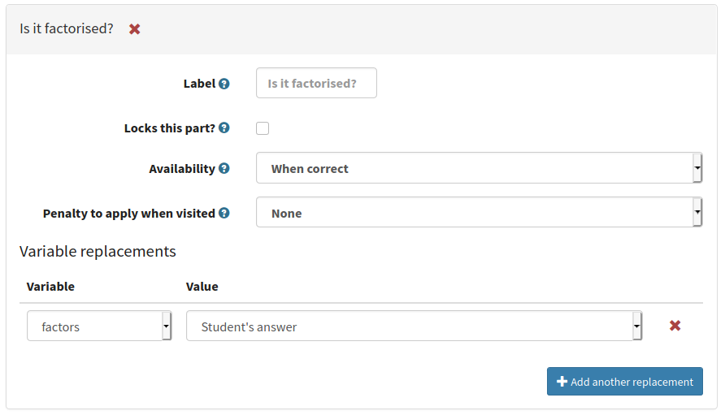

.. _explore-mode:

Explore mode
************

The "explore" parts mode allows the creation of adaptive questions.

Rather than showing the student a fixed list of parts that they must answer in sequence, explore mode presents the student with a single part at a time.
The student is shown a list of options for "next parts" to navigate to.
The available parts can vary depending on the student's interaction with the current part - you could offer a hint before the student submits their answer, or only offer a certain path if the student answers the part correctly.

When the student moves to another part, you can update the question's variables using data from the student's answer to the current part.
With this, you can create powerful, adaptive exploration activities.

Use cases
=========

Here are some of the use cases that explore mode was designed for:

* Offer a selection of hints at varying degrees of helpfulness.
* Walk the student through an iteractive algorithm, giving feedback on each step.
* Allow the student to choose the method they want to use to solve a problem.
* Take free input from the student, such as measurements or an example of an object, then ask them questions about it.
* Ask the student to define the criteria for a test, then assess their decisions based on those criteria.

Parts in explore mode
=====================

In the editor, you define one or more question parts.
The first part in the list is the one that students are shown when they start the question.

These are *definitions* of parts; when a the student moves to a particular part, an *instance* of it is created, using the current values of the question variables.
There can be more than one instance of a part: when the student takes a "next part" option that they haven't taken before, an entirely new instance of that part is created, and any existing instances are unaffected.

In explore mode, the question statement is always visible above the current part.
The statement is not updated to reflect variable replacements when you move to another part.

Scoring
=======

The student's scores for each part they visit are collected into pre-defined :guilabel:`Objectives`.
The student's total score for the question is the sum of their objectives minus any penalties accrued for visiting parts, or the question's :guilabel:`Maximum mark`, whichever is lower.

Click on :guilabel:`Explore mode options` at the top of the parts list to set up the question's objectives and penalties.

.. glossary::

   Maximum mark
      The maximum mark the student can be awarded for this question.
      If the total obtained by adding up the scores for the objectives and taking away penalties exceeds this amount, this amount is awarded instead.

   Show objectives
      If :guilabel:`Always` is chosen, all objectives are shown in the score breakdown table.
      
      If :guilabel:`When active` is chosen, only objectives corresponding to parts that the student has visited are shown.

   Show penalties
      If :guilabel:`Always` is chosen, all penalties are shown in the score breakdown table.

      If :guilabel:`When active` is chosen, only penalties which have been applied are shown.

Objectives
----------

Each objective has a :guilabel:`Name`, which is shown to the student, and a :guilabel:`Limit`.
Students can accumulate marks toward an objective up to the limit.

Use the limit to restrict how many marks the student can earn for performing a certain task.

.. _explore-penalties:

Penalties
---------

Each penalty has a :guilabel:`Name`, which is shown to the student, and a :guilabel:`Limit`.
Each time the student chooses a :ref:`next part` option which applies a penalty, the defined number of marks is added to the corresponding penalty, up to the limit.

The penalty is not re-applied each time the student revisits an instance of a part.

Use the limit to avoid over-penalising the student for taking a particular option repeatedly.

.. _next-parts:

Next parts
==========

Each part has a :guilabel:`Next parts` tab, where you define which parts the student can visit next.

To add an option, click the :guilabel:`Add a next part option` button, and select a part.

For each "next part" option, you can define a condition for its availability, a list of variable replacements to make when chosen, and an optional penalty to apply when the student chooses this option.

The student can navigate back to previous parts at any time, using the navigation tree at the top of the question.
If the student changes their answer to a previous part, this could invalidate any next parts they have chosen, so all instances of next parts which use the student's answer in variable replacements are removed when the student changes their answer.

.. glossary::

   Label
      The label on the button shown to the student.
      If you leave this blank, the next part's name is used.
      You might want to change the label so you don't reveal the destination, or to differentiate two options which lead to the same part.

   Lock this part?
      If ticked, the current part will be locked when the student chooses this next part option.
      The student will not be able to change or resubmit their answer to this part.

      If not ticked, the student can come back to this part and change their answer.

      Use this if a subsequent part would reveal information which the student could use to improve their answer to this part, and you don't want them to do that.

   Availability
      Define when the option is available to the student.
      
      * :guilabel:`Always` - always available.
      * :guilabel:`When answer submitted` - available once the student has submitted a valid answer to this part, whether it's correct or not
      * :guilabel:`When unanswered or incorrect` - available if the student hasn't submitted an answer, or if they've submitted an incorrect answer. Unavailable once they submit a correct answer.
      * :guilabel:`When incorrect` - available after the student submits an incorrect answer.
      * :guilabel:`When correct` - available once the student submits a correct answer.
      * :guilabel:`Depending on expression` - available if the :term:`Available if` expression evaluates to ``true``.

   Available if
      This field is only shown when :term:`Availability` is set to :guilabel:`Depending on expression`.

      Write a JME expression which evaluates to ``true`` when the option should be available to the student, and ``false`` otherwise.

      The following variables are defined during the evaluation of this expression:
      
      * all question variables;
      * the values of any marking notes produced by this part's :ref:`marking algorithm <marking-algorithm>`;
      * ``credit``, a :data:`number` between 0 and 1 corresponding to the amount of credit awarded for this part;
      * ``answered``, a :data:`boolean` representing whether the student has submitted a valid answer.

   Penalty to apply when visited
      If you want to apply a penalty when the student chooses this option, select the name of a :ref:`penalty <explore-penalties>` here.

   Amount of penalty
      The number of marks to add to the chosen penalty.

      Only shown if :term:`Penalty to apply when visited` is not "None".

Variable replacements
---------------------

When the student selects a next part option, you can replace the values of question variables before the part instance is created.
These changes only affect the next part, not the current one.

Here are some examples of what you can do with variable replacements:

* Track the number of times a student has visited a certain part. For example: replace ``n`` with ``n+1``.
* Replace a question variable with the student's answer. For example: ask them to give a number which you'll later ask them to factorise; ask them to enter measurements from an experiment.
* Update the state of a simulation. For example: when factorising the number ``n``, the student enters a factor and you replace ``n`` with ``n/interpreted_answer``.

Click :guilabel:`Add a variable replacement` to define a new variable replacement.

For each replacement, you must select the name of the variable you want to replace, and then define what it's replaced with, from the following options:

.. glossary::
   Student's answer
      The student's answer to this part, drawn from the :data:`interpreted_answer` marking note.

   Credit awarded
      The amount of credit awarded to the student for this part, a :data:`number` between 0 and 1.

   JME expression
      The variable's value is replaced with the result of the given :ref:`JME` expression.

      The following variables are defined during the evaluation of the expression:

      * all question variables;
      * the values of any marking notes produced by this part's :ref:`marking algorithm <marking-algorithm>`.

Identifying the current part in JME
===================================

Every question part has a unique *path*, which can be used to identify it.

In explore mode, a part instance's path can't be known until it's created, so each part instance defines a variable ``part_path``, which can be used while substituting values into content areas or in marking algorithms.
