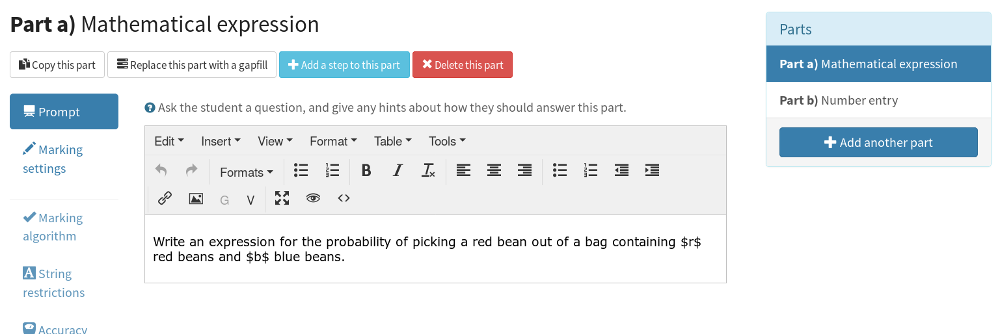
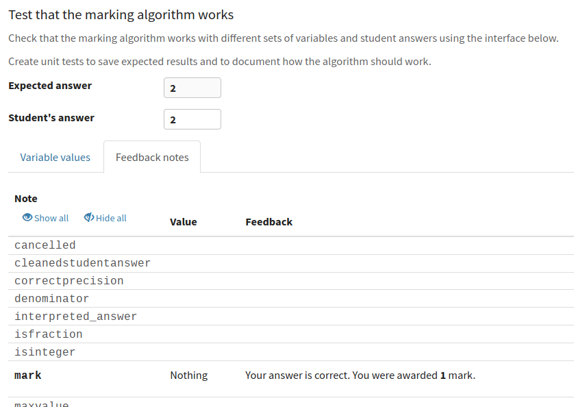
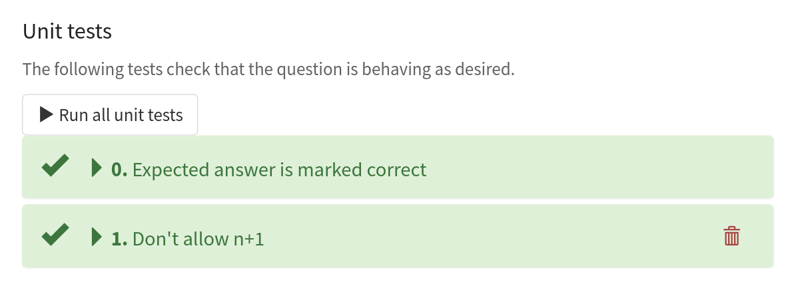

.. _parts:

Question parts
##############

Each question has one or more parts.
The student is given a separate score for each part of the question, and their total score is the sum of their scores for each part.

In the editor, parts are displayed in a list.
Click on a part's name to edit it.

The **type** of a part defines how it appears to the student, and how it is marked.
Different part types offer different settings fields to configure the display and marking of the part.

Generic part properties
=======================

The following properties are available on every type of part.

.. glossary::
    Name
        Every part is automatically assigned a name, displayed at the top of the editing area, next to the part's type.
        Click the part's name to edit it.

        Question variables can be substituted into the name by enclosing them in curly braces.

    Prompt
        A content area used to prompt the student for an answer.

    Marks
        The number of marks to award for answering the part correctly.

    Steps
        An optional list of sub-parts which the student can reveal by clicking on a button. 
        Marks awarded for steps don't increase the total available for the part, but are given in case the student gets a lower score for the main part.

    Penalty for revealing steps
        If the student reveals the Steps, reduce the total available marks by this amount. 
        Credit for the part is scaled down accordingly. 
        For example, if there are 6 marks available and the penalty for revealing steps is 2 marks, the total available after revealing steps is 4. 
        An answer worth 3 marks without revealing steps is instead worth :math:`3 \times \frac{4}{6} = 2` marks after revealing steps.

    Show correct answer on reveal?
        When the student reveals answers to the question, or views the question in review mode, should a correct answer be shown? You might want to turn this off if you're doing custom marking and the part has no "correct" answer.

    Show score feedback icon?
        After the student submits an answer to this part, should an icon describing their score be shown?
        This is usually shown next to the input field, as well as in the feedback box.
        This option also controls whether feedback messages are shown for this part.
        You might want to turn this off if you've set up a question with a custom marking script which assigns a score based on the answers to two or more parts (or gapfills), meaning the individual parts have no independent "correct" or "incorrect" state.

    Score counts towards objective
        In :ref:`explore mode <explore-mode>`, marks awarded for this part will count towards the chosen :ref:`objective <objectives>`.

.. _part-types:

Part types
==========

The following part types are built-in to Numbas:

.. toctree::
    :maxdepth: 1

    mathematical-expression
    numberentry
    matrixentry
    match-text-pattern
    multiple-choice
    gapfill
    information
    extension

:ref:`Custom part types <custom-part-types>` defined by you or other Numbas users provide extra functionality.
The list of available custom part types comprises those published by their authors, as well as those made by you or other members of the project your question belongs to.

.. _part-marking-algorithm:

Marking algorithm
=================

The marking algorithm tab allows you to customise the script used to mark the student's answer, and test that it works correctly on answers that you provide.

See the page on :ref:`marking algorithms <marking-algorithm>` for more on how marking algorithms work.

.. glossary::

    Use custom marking algorithm?
        If this is ticked, the algorithm entered in the code field below will be used.

    Extend base marking algorithm?
        If this is ticked, all marking notes provided by the part's standard marking algorithm will be available.
        If the same note is defined in both the standard algorithm and your custom algorithm, your version will be used.

In the part editor, the entire marking algorithm is written in one field.
Notes are separated by double-linebreaks, and are of the following format::

    name (Label):
        definition

The name must be a valid :ref:`variable name <variable-names>`. 
The label is an optional string of text enclosed in parentheses, which can describe in more readable language what the note represents.
The definition is a :ref:`jme` expression used to evaluate the note.

.. _standard-part-settings:

.. data:: settings
    :noindex:

    The following settings are available for every type of part.
    Other part types will provide further settings.

    .. data:: stepsPenalty

        The number of marks to deduct when the steps are shown.

    .. data:: enableMinimumMarks

        Is there a lower limit on the score the student can be awarded for this part?

    .. data:: minimumMarks

        Lower limit on the score the student can be awarded for this part.

    .. data:: showCorrectAnswer

        Should the expected answer to this part be shown when answers to this question are revealed?

    .. data:: hasVariableReplacements

        Does this part have any variable replacement rules?

    .. data:: adaptiveMarkingPenalty

        The number of marks to deduct when adaptive marking is used.

    .. data:: showFeedbackIcon

        Show the tick/cross feedback symbol after this part is submitted?
        See :term:`Show score feedback icon?`

Test that the marking algorithm works
-------------------------------------

Whether you're using a custom marking algorithm or not, you can test how it behaves given certain answers.

The first half of the testing section provides a field to enter an answer to the part, and the table below shows the feedback notes produced by the marking algorithm.
Click on a note to toggle its visibility - most of the time, you'll only be interested in a few of the notes.

The :guilabel:`Variable values` tab shows the current values of the question's variables, which you may need in order to come up with an answer for the part.
The values here are the same as shown in the :ref:`variables` tab, and are regenerated whenever the question changes, or when you click the :guilabel:`Regenerate values` button.
You can lock the value of a variable, so it is not regenerated until you unlock it, by clicking on the padlock icon next to its name.

Click on the :guilabel:`Create a unit test` button to add a :ref:`unit test <unit-tests>` with the current variable values and student answer.
Only the marking notes you've selected to show will be included in the unit test.

.. _unit-tests:

Unit tests
----------

:dfn:`Unit tests` allow you to save the state of the marking algorithm after it has run, to confirm after making any changes to the part or question that the same behaviour is produced.
The student's answer and the values of all question variables are saved, along with the value and feedback corresponding to marking notes that you have selected.

Give a unit test a label which describes the behaviour it is testing for, for example, "correct answer" for a test that checks the correct answer earns full credit, or "give feedback when student adds instead of subtracting" for a test that checks the right feedback message is displayed when the student makes a particular error.

Clicking the :guilabel:`Run this test` button inside a unit test will cause the marking algorithm to be run against the stored student answer and variable values.
If any of the notes included in the test produce a different value or different feedback than expected, the test will fail.
When that happens, you can use the :guilabel:`Expected` entries in the feedback table to guide the process of fixing the marking algorithm so it produces the expected feedback.
Alternatively, you can choose to :guilabel:`Accept the current values` if you want to accept the new behaviour - this will update the test to accept the current values, and reject any others.

Click the :guilabel:`Run all unit tests` button to run all unit tests belonging to a part.

.. _part-scripts:

Scripts
=======

The script fields allow you to override the built-in algorithms used by Numbas. 
They take JavaScript code; `the Numbas JavaScript API documentation for parts <https://docs.numbas.org.uk/runtime_api/en/latest/Numbas.parts.Part.html>`_ is a useful reference.

.. note::
    
    Most customisation of marking can be done using a :ref:`custom marking algorithm <marking-algorithm>`.
    The scripts feature was introduced before custom marking algorithms, so the scope for its use is now quite limited.

Scripts have access to the global ``Numbas`` object, as well as the following variables:

.. attribute:: part

    The current part

.. attribute:: question

    The part's parent question

.. attribute:: variables

    The question's variables, unwrapped to JavaScript objects (so numbers can be used as JavaScript numbers, instead of having to go through the JME system)

Custom scripts can run *before*, *instead of*, or *after* the built-in script.
If *instead of* is chosen, the built-in script never runs; you must make sure that your script does everything required.
You might want to run a custom script *before* the built-in one to modify a setting before the normal logic is applied, or run it *after* to do some extra processing or add information.

The following scripts can be customised:

.. glossary::

    When the part is created
        This function runs when the part is created (either at the start of the exam, or when the question is regenerated), after the built-in constructor for the part. 
        You could use this to change any of the part's settings, if it's not convenient to do so by other means.

    Mark student's answer
        This function runs when the student's answer is submitted.
        It should establish what proportion of the available credit to award to the student for their answer, and give feedback messages. 
        Use ``this.setCredit(credit,message)`` to set the credit and (optionally) give a message. 
        Note that ``this.answered`` should be set to true if the student's answer can be marked - otherwise, the student will be shown a warning message.

    Validate student's answer
        This functions runs after the marking function, and should return ``true`` if the student's answer is in a form that can be marked, or ``false`` otherwise. 
        If the answer can't be marked, you should use ``this.giveWarning(message)`` to tell the student what's wrong.

There are several example questions using custom scripts at `numbas.mathcentre.ac.uk/exam/1016/custom-marking/ <https://numbas.mathcentre.ac.uk/exam/1016/custom-marking/>`_.

.. _alternative-answers:

Alternative answers
===================

.. admonition:: Motivation

    If there are several acceptable answers to a part, use "alternative answers" to check for each of them.

    Or, if there's an error that you expect the student to make, you can set it up as an alternative answer so you can give the student a relevant hint in their feedback.

You can define any number of "alternative answers" to catch answers you might expect the student to submit, and award full, partial or zero credit along with a tailored feedback message.

In the editor, an "alternative answer" is a copy of the parent part, with only the fields relevant to marking shown.
Set the "alternative answer" version up so it awards full credit when you want it to apply. 

When the student submits an answer to a part with alternative answers, the following happens:

* The student's answer is marked against the normal marking settings. 
  This produces an amount of credit and some feedback messages.
* The student's answer is marked against each of the "alternative answer" versions in turn, producing an amount of credit. 
  Any feedback messages produced by the marking algorithm are discarded, unless :guilabel:`Show all feedback?` is ticked for this version.
* If this version would award the student more marks (or more credit, if this and all previous versions awarded no marks) than any of the versions considered so far, keep this version's feedback message.
* Once all versions have been considered, show the feedback corresponding to the one that awarded the most marks or credit.

Practically, set up each alternative answer to mark an answer "correct" if you want to show the corresponding feedback message.
You could just set the :guilabel:`Correct answer` field to the answer you'd expect the student to enter if they made a particular error, or you could set up a :ref:`custom marking algorithm <part-marking-algorithm>` to catch a variety of errors.

.. glossary::

    Show all feedback?
        If ticked, when this alternative is used, all of the feedback items produced during marking are shown to the student, in addition to the :term:`Message if this alternative is used`.

        If not ticked, when this alternative is used, only the :term:`Message if this alternative is used` is shown to the student, and all other feedback is discarded.
        You might want this if the alternative represents an incorrect answer, and the built-in marking algorithm would produce a message like "Your answer is correct".

    Message if this alternative is used
        If this alternative is the one whose feedback is shown, this message is added to the end of the feedback.
        You could use this to give the student a hint about the error they've made, or describe which of several acceptable solutions they've given.

.. _adaptive-marking:

Adaptive marking
================

Adaptive marking allows you to incorporate the student's answers to earlier parts when marking their answer to another part.
You could use this to allow an "error carried forward" marking scheme, or in more free-form questions where one part has no correct answer - for example, "think of a number and find its square root".
This is achieved by replacing the values of question variables with the student's answers to other parts.
When a variable is replaced, any other variables depending on that one are recalculated using the new value.
All other variables keep their original values.

As an example, suppose part **a** of your question asks the student to calculate the mean of a set of numbers. 
The correct answer for this part is the variable ``sample_mean``.
Part **b** then asks the student to calculate a *z*-statistic based on the mean of the sample. 
The correct answer to this part is the variable ``z_statistic``, which is defined as ``(sample_mean-population_mean)/sqrt(population_variance)``.
(``population_mean`` and ``population_variance`` in this case are random numbers)

If the student makes an error in calculating the sample mean but uses the right method to find a *z*-statistic, they shouldn't be penalised in part **b**. 
We can ensure this by replacing the value of ``sample_mean`` with the student's answer to part **a** when marking part **b**.
When the student submits an answer to part **b**, the value of ``z_statistic`` will be automatically recalculated using the student's value of ``sample_mean``. 
Then, if the student correctly applies the formula, their answer will match the new value of ``z_statistic`` and they will receive full credit for the part.

.. topic:: Settings

    .. glossary::

        Variable replacement strategy

            The circumstances under which the variable replacements are used, and adaptive marking is applied.
            There are two variable replacement strategies:

            :guilabel:`Try without replacements first`:
            The student's answer is first marked using the original values of the question variables.
            If the credit given by this method is less than the maximum available, the marking is repeated using the defined variable replacements.
            If the credit gained with variable replacements is greater than the credit gained under the original marking, that score is used, and the student is told that their answers to previous parts have been used in the marking for this part.

            :guilabel:`Always replace variables`:
            The student's answer is only marked once, with the defined variable replacements applied.

        Penalty when adaptive marking is used

            If adaptive marking is used, reduce the total available marks by this amount. 
            Credit for the part is scaled down accordingly. 
            For example, if there are 6 marks available and the penalty for using adaptive marking is 2 marks, the total available after revealing steps is 4. 
            An answer worth 3 marks without the penalty is instead worth :math:`3 \times \frac{4}{6} = 2` marks when adaptive marking is used.
        
.. warning::
    This feature can be very powerful, but make sure you don't introduce any new random variation in these dependent variables, or the correct answer will change each time the student submits their answer.

    The editor will try to catch these cases and show you a warning, with a list of the problematic variables. 
    Resolve this by moving the random elements to new variables.

    For example, in the following set of variables, ``b`` depends on ``a`` and also has a random element::

        a = random(1..5)
        b = a*random(1,-1)

    In a part where ``a`` is replaced with the answer to a previous part, ``b`` will be regenerated with the new value of ``a``. 
    However, each time this happens, it will be multiplied by a random value. 
    To fix this, create a new variable ``b_sign``::

        a = random(1..6)
        b_sign = random(1,-1)
        b = a*b_sign

    With this setup, ``b`` is always multiplied by the same value because ``b_sign`` does not depend on the replaced variable ``a``, so it is not regenerated when the part is submitted.

.. topic:: Variable replacements

    .. glossary::

        Variable
            The name of the variable to replace

        Answer to use
            The part whose answer the variable's value should be replaced with. 
            Different part types produce different types of values.

        Must be answered?
            If this is ticked, the student must submit an answer to the referenced part before they can submit an answer to this part.

    .. _part_type_variable_replacement:

.. topic:: Values obtained from the answers to each part type

    =========================== ==============
    Part type                   Value obtained
    =========================== ==============
    Gap-fill                    A :data:`list` containing the values obtained from each of the gaps
    Mathematical expression     A JME :data:`expression`. 
                                When used in a variable definition, the subexpression will be substituted in, and any references to question variables in the subexpression will be replaced with their respective values.
    Number entry                A :data:`number`
    Matrix entry                A :data:`matrix`
    Match text pattern          A :data:`string`
    Choose one from a list      The :data:`number` index of the answer the student chose, starting at 0
    Choose several from a list  A :data:`list` of :data:`boolean` values: true if the student ticked the corresponding choice, false otherwise
    Match choices with answers  A 2D :data:`list` of lists of :data:`boolean` values, in the same format as a :term:`custom marking matrix` for this part - cells are addressed by choice first, and answer second.
    =========================== ==============

    The following screencast shows the addition of adaptive marking to a question:

    .. todo:: Redo this screencast

    .. raw:: html

        <iframe src="https://player.vimeo.com/video/134209217" width="500" height="281" frameborder="0" webkitallowfullscreen mozallowfullscreen allowfullscreen></iframe>
