.. _questions:

Questions
*********

In Numbas, a *question* is a self-contained assessment of a particular scenario. 
Every Numbas question consists of three sections: :ref:`Statement <statement>`, :ref:`Parts <parts>`, and :ref:`Advice <advice>`.

* In the :ref:`Statement`, the context for the question is given to the student. 
* :ref:`Parts <parts>` are where the student enters their answers. 
  A question can have one or more parts, each of which is one of several types, depending on what kind of input you want from the student. 
* Finally, the optional :ref:`Advice` section can be used to give a full solution to the question, which the student can request to see if they're stuck, or once they've finished the exam.

The content in each section is generated each time the question is run, based on the question's :ref:`variables <variables>`.

.. contents:: Contents of this page
   :local:
   :depth: 1

Creating a question
====================

To create a question from any page in the Numbas editor, click on the plus icon at the top of the page, and select :guilabel:`Question`. 

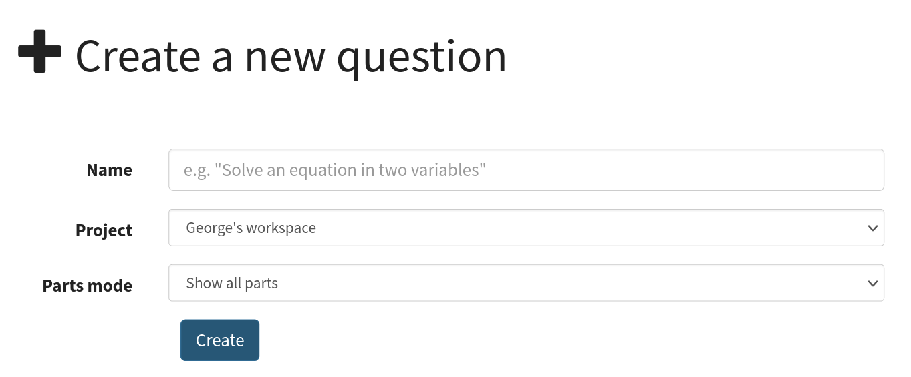

You must give a name for your question, and select a :doc:`project </project/reference>` for it to go in. 
The default project is your personal workspace; you can always move the question to another of your projects later on.

The question editor
===================

At the top of the question editor is the question's name, as well as a stamp showing the status of the question.

.. _question-stamps:

Click on the status stamp to give feedback about the quality of an question, after test running it. 
The options are listed in descending order of "suitability for use":

Ready to use
    This question is of sufficient quality to give to students.
Should not be used
    This question works, but you deprecate its use - for example, if it's not intended for use by students, or there's a better version elsewhere.
Has some problems
    This question works, but has some problems which mean it's not ready for use by students - for example, the question is incomplete, or changes need to be made to the text. 
    Further work is needed before this question can be given to students.
Doesn't work
    This question doesn't even run!
Needs to be tested
    This question looks alright to me, but it should be checked thoroughly before being used.

On the left of the screen are :ref:`question-admin-controls` and labels for each of the editing tabs.

.. _question-admin-controls:

Admin controls
==============

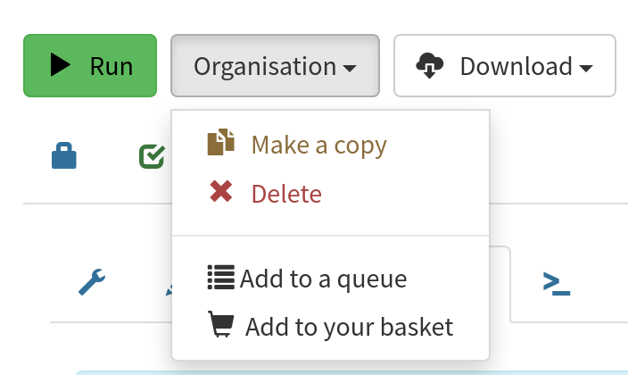

.. glossary::

    Run
        Opens a preview of the question in a new window. 
        A specially simplified theme will be used, different from the one used for exams.

        .. warning:: 
            Do **NOT** use this link to deliver the question to students. 
            This link is not permanent and could stop working at any time.
            Instead, either download the exam and put it on your own webspace or in a VLE, or use the :guilabel:`Share` button on the preview to obtain a permanent link.

    Make a copy
        Create a copy of the question. 
        Use this to make changes to an question which does not belong to you.

    Delete
        Delete the question permanently from the database. 

    Download
        Links to download standalone packages of the question. 

        * :guilabel:`standalone .zip` - a compiled package of the question, ready to run anywhere without connecting to a VLE. 
        * :guilabel:`SCORM package` - a compiled package of the question with SCORM files included, so it can be uploaded to a VLE and communicate with its gradebook.
        * :guilabel:`source` - a plain-text representation of the question, to be used with the Numbas command-line tools.

    Add to your basket
        Add this question to your basket, so you can include it in an exam.

.. _content-areas:

Content areas
=============

Each portion of text displayed to the student (for example, the statement, advice, and part prompts) is a *content area*.  
A content area can include text, images, or more dynamic content such as videos and interactive diagrams.

By default, text is edited using the rich text editor. 
Click on the :guilabel:`Source code` button to edit the raw HTML code for the content area.

Click on the :guilabel:`Preview` button to see how the content will look with question variables substituted in.

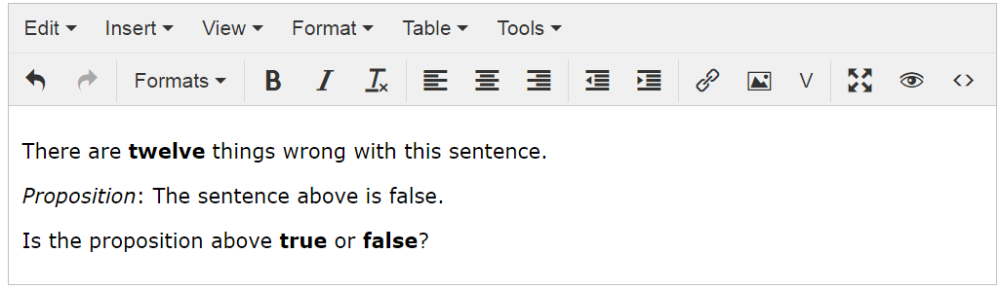

    The rich text editor

You can write mathematical notation in content areas using LaTeX; see the section on :ref:`LaTeX notation`.

There is a button in the :ref:`rich text editor <content-areas>` labelled :guilabel:`Conditional visibility`.
This allows you to give an expression (in :ref:`JME` syntax) which dictates whether or not the selected text is shown. 
You can use this to :ref:`show one of several blocks of text based on a random variable <conditional-visibility>`.

.. _substituting-into-content:

Substituting variables into content areas
-----------------------------------------

There are two modes of variable subsitution: substitution into plain text (or HTML), and substitution into mathematical expressions. 

Here's a quick summary of the different methods of substituting variables into question text, to help you choose:

+---------------------------+--------------------------+----------------------------------------------+
| I want to substitute      | Such as                  | So use                                       |
+===========================+==========================+==============================================+
| A text string             | Someone's name           | Curly braces, e.g. ``{name} is a farmer.``   |
+---------------------------+--------------------------+----------------------------------------------+
| A single number into a    | :math:`x` in             | :ref:`\\var <simplification-rules>`,         |
| LaTeX expression with     | :math:`a = x`            | e.g. ``$a = \var{x}$``                       |
| no surrounding operators  |                          |                                              |
+---------------------------+--------------------------+----------------------------------------------+
| Several numbers into a    | :math:`a`, :math:`b` and | :ref:`\\simplify <simplification-rules>`,    |
| LaTeX expression          | :math:`c` into           | e.g. ``$\simplify{ {a}x^2 + {b}x + {c} }$``  |
|                           | :math:`ax^2+bx+c`        |                                              |
+---------------------------+--------------------------+----------------------------------------------+

Substitution of variables into plain text is straightforward: just enclose the variable name (or any :ref:`JME` expression) in curly braces. 
For example::

    Bob the farmer has {num_animals} {animal_name}.

produces::

    Bob the farmer has 12 sheep.

when ``num_animals = 12`` and ``animal_name = "sheep"``.

The substitution of variables into a mathematical expression is more complicated: depending on context, the surrounding expression may need to be change for different values of the substituted variables. 
Numbas provides a simple system to handle substitution of variables into mathematical expressions; see the section on :ref:`simplification-rules`.

.. _statement:

Statement
=========

The statement is a content area which appears at the top of the question, before any input boxes. 
Use the statement to set up the question and provide any information the student needs to answer it.

.. note::
   Only use the statement area to give information, don't ask a question.
   Do that in the :term:`prompt` area of each part.

Parts
=====

.. admonition:: Motivation

   A *part* is an opportunity for the student to give an answer in response to a prompt.
   A question might contain more than one part if the student needs to perform a sequence of steps, and you want to assess each of them independently.

Each question has one or more *parts*.

In the editor, parts are displayed in a list on the right of a page; you can click on a part in the list to start editing it.
You can drag a part up or down to change its position in the question.

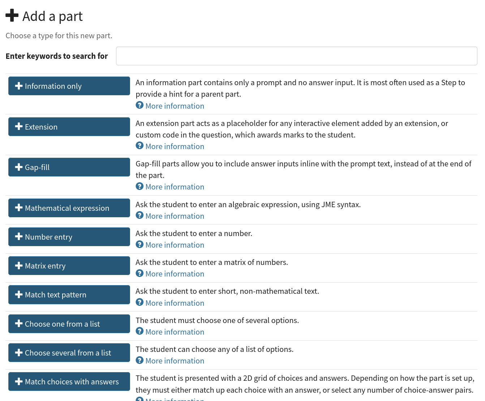

To add a new part to your question, click the :guilabel:`Add a part` button at the bottom of the list, then click on one of the part types shown.
You can filter the list by typing keywords in the search box at the top.
Built-in part types are shown first, followed by any :ref:`custom part types <custom-part-types>` you have access to.

See :ref:`parts` for more on part settings.

.. _parts-mode:

Part display mode
-----------------

There are two modes that dictate how question parts are presented to students.

You choose the part display mode when you create a question.
It isn't possible to change the part display mode of an existing question.

.. glossary::

   Show all parts
      In :guilabel:`Show all parts` mode, all parts are shown to the student in a list.
      The student is given a separate score for each part, and their total score is the sum of their scores for each part.

   Explore
      In :guilabel:`Explore` mode, the student's journey through the parts of the question is not determined in advance.

      When the question begins, the student is shown the first part.
      Each part defines a list of "next part" options, which the student can choose to follow.

      The student's scores from each part are collected into pre-defined :ref:`objectives`.
      The student might accumulate :ref:`penalties <explore-penalties>` by visiting certain parts.
      The student's total score for the question is the sum of their objective scores minus the sum of their penalties.

      See the page on :ref:`explore-mode`.

.. admonition:: Motivation

   The original Numbas design only allowed the 'Show all parts' mode, following the design of older systems.

   The 'explore mode' allows a wider range of interactive experiences, at the cost of a bit more setup by the author.

   Use the 'show all parts' mode if you just want the student to answer a fixed set of question prompts.

.. _variables:

Variables
=========

.. admonition:: Motivation

   The ability to randomise questions is one of the main benefits of computer-based assessment.
   When a question is randomised, all of the sections of the question are affected: statement and prompts, marking, and the advice.
   Variables represent randomly-generated values, as well as values derived from other variables.
   Variables can be referred to by name throughout the question's content areas and marking settings, so they're substituted in automatically when a student runs the question.
   Defining variables in terms of other variables makes it easy to organise and reuse sophisticated computations.

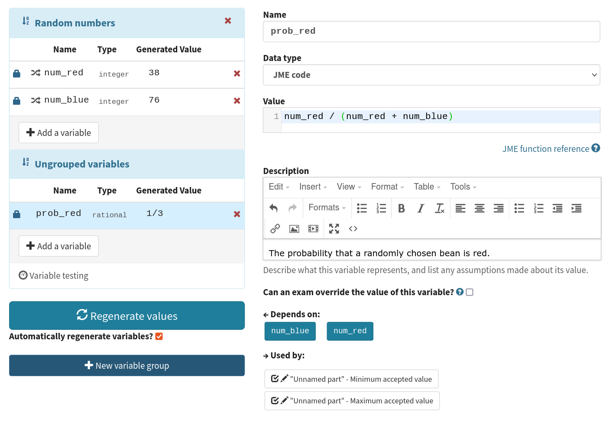

The :guilabel:`Generated value` column shows a generated value for each variable. 
Note that when the question is delivered to students, the variable values are generated with each new attempt, so students won't necessarily see the same values as those displayed here. 
It's a good idea to use the :guilabel:`Regenerate values` button a few times to check that randomised variables don't take unsuitable values.

You can reorder the variables in the list by dragging them. 
Doing this doesn't affect the way values are computed.

This screencast gives a quick summary of how the variable editing interface works:

.. raw:: html

    <iframe src="https://player.vimeo.com/video/167091112" width="640" height="360" frameborder="0" webkitallowfullscreen mozallowfullscreen allowfullscreen></iframe>

This screencast describes which variable names are valid, and gives some advice on how you should pick names:

.. raw:: html
    
    <iframe src="https://player.vimeo.com/video/167085662" width="640" height="360" frameborder="0" webkitallowfullscreen mozallowfullscreen allowfullscreen></iframe>

Definition
----------

.. glossary::
    Name
        The name of the variable. 
        See the :ref:`section on variable names <variable-names>`.

        You can assign more than one variable at once by writing several names separated by commas.
        The value must evaluate to a :data:`list`, or a type which can be converted to a :data:`list`.
        For example, ``x,y`` in the :guilabel:`name` field and ``[1,2]`` would assign a variable ``x`` with the value ``1`` and ``y`` with the value ``2``.

    Data type

        .. _variable-data-type:

        Specify what type of data the variable should hold. 
        The :guilabel:`JME code` option allows you to define the variable using :doc:`/jme-reference` syntax, while the other options provide simplified forms.

        The :guilabel:`JSON data` option allows you to enter raw `JSON <https://www.json.org/>`_ data, which is parsed into JME data.

        The :guilabel:`Short text string` and :guilabel:`Long text string` options have a checkbox labelled :guilabel:`Is this a template?`. 
        If ticked, the string will be marked as :jme:func:`safe <safe>`, and variable values will not be substituted into it.
        Use this in conjunction with the :jme:func:`render` function to write reusable pieces of text.

    Value
        Define the variable's value. 
        The format of this field depends on the data type.

    Description
        Describe what the variable means, and how it is used. 
        It's also often helpful to explain how it's defined, and what changes can be made to it.
        
        .. note::
            Don't underestimate the value of the description field!
            Variables whose meaning seems clear when you write them have a habit of becoming indecipherable months later.

    Can an exam override the value of this variable?
        If this is ticked, then when an exam uses this question the author can override the value of this variable with their own choice.

    Generated value
        This box shows a representative value of this variable.
        This is the same value as shown in the :guilabel:`Variables` list.
        Click :guilabel:`Regenerate variables` to generate another value.

        When you run the question or include it in an exam, a fresh value is generated for each attempt at the question.

    Depends on
        A list of all variables used in this variable's definition. 
        You can click on a variable name to go to its definition.
        If the variable hasn't been defined yet, it'll be created.

    Used by
        A list of all variables which use this variable in their definition, and other places in the question which use this variable.
        You can click on a variable name to go to its definition, or click on a reference to go the relevant section of the editor.

Locking variable values
-----------------------

.. admonition:: Motivation

   Sometimes you want to focus on a particular case in a randomised question.
   Rather than constantly regenerating all the question's variables to get back to the case you want, or temporarily redefining the involved variables to fixed values, you can lock a variable to keep its current value until you're ready to re-randomise it.

The preview values for each question variable are regenerated each time you click on the :guilabel:`Regenerate variables` button or, if the :guilabel:`Automatically regenerate variables when changes are made` option is ticked, whenever a variable definition is changed.

You can **lock** the value of a variable so that it doesn't change when the other variables are regenerated.
To do so, click on the padlock icon next to the variable's name.
Any variables used in the definition of the locked variable (those which appear in the :guilabel:`Depends on` list) will also be locked implicitly, so that you don't end up with an inconsistent set of variables.
You can unlock a variable by clicking on the padlock icon again.

.. warning::
    Variables are only locked inside the editor's preview area - when you run the question, or include it in an exam, a fresh value for the variable will be generated.

.. _variable-testing:

Variable testing
----------------

.. admonition:: Motivation

   Sometimes it's hard to define randomised question variables so they're guaranteed to produce a usable set of values.
   In these cases, it's easier to state the condition you want the variables to satisfy, and let Numbas automatically throw out sets of values that don't work.

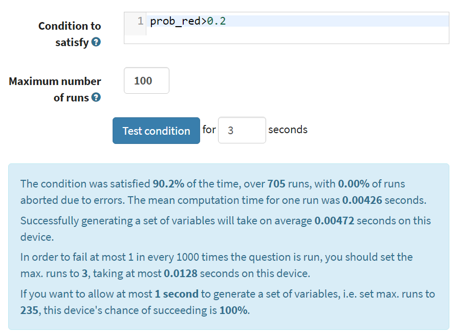

This tab provides tools to test your variables for desired properties, so you can automatically re-randomise your questions' variables until you get a suitable set of values.

`Example question using variable testing tools <https://numbas.mathcentre.ac.uk/question/6789/variable-testing/>`_.

.. warning::
    While this tool allows you to pick sets of variables that would be hard to generate constructively, it's a random process so you must be aware that there's a chance no suitable set of values will ever be found. 
    Use the :guilabel:`Test condition` button to see how likely this is.

.. glossary::

    Condition to satisfy
        A JME expression which should evaluate to `true` when the set of variables generated has the properties you want. 
        For example, if `a`, `b` and `c` are the coefficients of a quadratic equation and you want it to have real roots, the condition could be `b^2-4*a*c>=0`.

        When the student runs this question, the system will regenerate the set of variables until it finds one which satisfies this condition.

    Test condition
        When you press this button, the editor will generate as many sets of variables as possible within the time given. 
        When it finishes, you'll be presented with statistics including the proportion of runs which produced acceptable sets of values, and the expected number of runs before an acceptable set of values is found.

        If the calculate probability of getting an acceptable set of variables within 1 second is lower than 99%, you should make changes to your variable definitions.

    Maximum number of runs
        The maximum number of times the system should regenerate the set of variables without finding a set which satisfies the condition before giving up. 
        If the system exceeds this number in a compiled exam, the entire exam will fail, so try to avoid it!

.. _exam-variables:

Exam variables
--------------

There are a couple of variables defined at the exam level, whose values are available to every question in the exam.

You can use these to coordinate values between separate questions, perhaps using the :jme:func:`seedrandom` function.

.. jme:variable:: initial_seed

    The initial "seed" :data:`string` value for the random number generator.
    A randomised expression evaluated with the same seed will always produce the same value.

.. jme:variable:: student_id

    A :data:`string` identifier for the student, which might be provided by the VLE.
    If this is not given or the exam is run in standalone mode, its value is the empty string.

.. _advice:

Advice
======

.. admonition:: Motivation

   Students find it enormously valuable to see a full solution to a question they've attempted, to compare against their own working.
   During formative use, students might reveal the advice to remind themselves of the techniques required, then regenerate the question and try again.

:guilabel:`Advice` is a content area which is shown when the student presses the :guilabel:`Reveal` button to reveal the question's answers, or at the end of the exam.

The advice area is normally used to present a worked solution to the question.

.. _question-scripts:

Extensions & scripts
====================

This tab contains tools to change the behaviour of your question, using pre-built extensions, redefining constants, or by adding custom JME functions and JavaScript.

Extensions
-----------

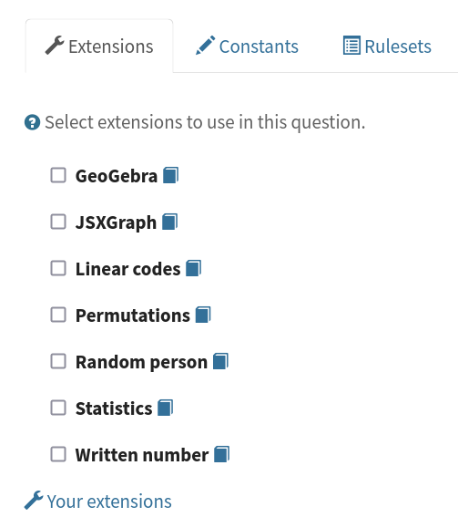

.. admonition:: Motivation

   Extensions can provide new functionality, such as extra JME functions or content types.

   Some extensions include large external libraries or modify the behaviour of Numbas in a way that not everyone wants, so they're not included in Numbas by default, and made available as optional extras instead.

To use an extension in your question, tick its checkbox here. 
All functionality provided by the extension will become available immediately.
See the section on :ref:`extensions <extensions>`.

.. _question-constants:

Constants
---------

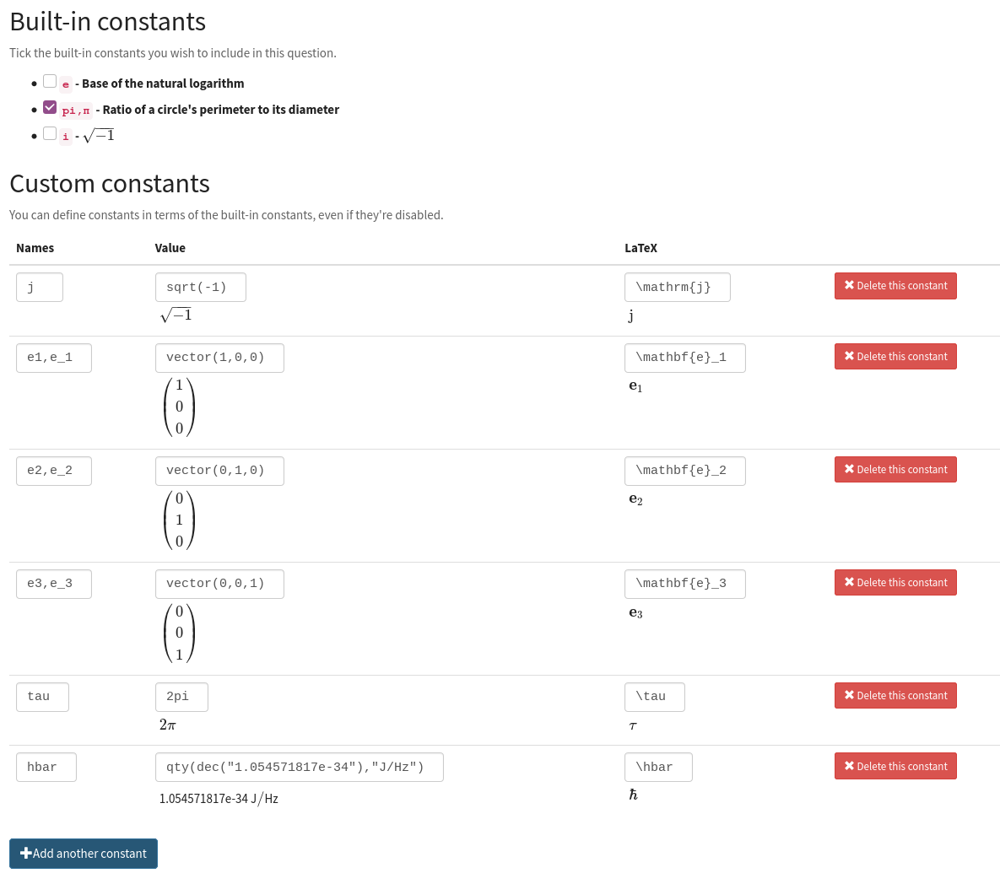

.. admonition:: Motivation

    The meaning of some symbols differs depending on the context you're working.
    Numbas has some built-in constants, such as :math:`\pi` and :math:`i` for the circle constant and the imaginary unit, respectively.
    You can disable the built-in constants, override them with different values, or define new constant symbols.

    Common alternate notations for constants include :math:`j` for the imaginary unit and :math:`\tau = 2\pi` for the circle constant.

Constants in JME expressions are replaced with their values when evaluating, and rendered using their particular symbols in LaTeX.

Constants defined in this tab are available throughout the whole question, including variable definitions and student answers to :ref:`mathematical expression <mathematical-expression>` parts.

There are some built-in constants.
Untick any that you don't want to use - the corresponding symbols will be treated as free variables unless you define a new constant with the same symbol.

Under :guilabel:`Custom constants`, click the :guilabel:`Add a constant` button to define a new constant.

The :guilabel:`Names` field should contain a comma-separated list of :ref:`JME variable names <variable-names>` that can be used to refer to the constant.

The :guilabel:`Value` field should contain a :ref:`JME <jme>` expression giving the value of the constant.
You can refer to the built-in constants in this expression, even if you have disabled them.

The :guilabel:`LaTeX` field should contain some LaTeX code that is used to represent the constant.

When a JME expression is rendered as LaTeX, any values equal to a defined constant are rendered using that constant's LaTeX code.

There are some 'common constants': the circle constant, the imaginary unit, the base of the natural logarithm, and infinity.

Any constant equal to :math:`k\pi` or :math:`\frac{1}{k}\pi`, where :math:`k \in \mathbb{N}`, will be used as the circle constant.

The imaginary unit, :math:`\sqrt{-1}`, is used when rendering complex numbers.

The base of the natural logarithm, :math:`e = 2.71828 \ldots`, is used when rendering exponentials.

.. _rulesets:

Rulesets
--------

.. admonition:: Motivation

   If you find yourself using the same set of rules repeatedly in ``\simplify`` commands, define a new ruleset with a shorter name to save yourself some typing.

A "ruleset" defines a list of named :doc:`simplification rules </simplification>` used to manipulate mathematical expressions.

.. _question-functions:

Functions
---------

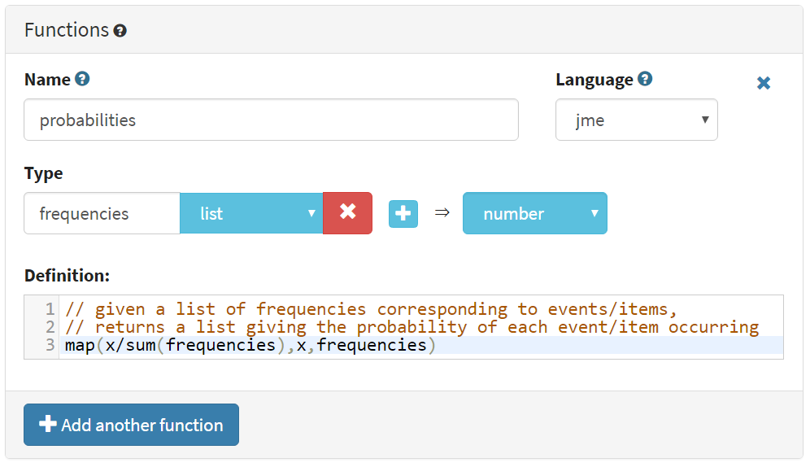

.. admonition:: Motivation

   If you need to do something a bit more complicated with variables, or you find yourself repeating the same pattern over and over, you can define a custom function.
   
   Complicated algorithms, or dynamically-generated sections of display content, are often easier to implement in JavaScript than JME.
   Custom functions allow you to wrap up JavaScript code as a JME function.

Custom functions can be used in any JME expression in the question, such as variable definitions or part answers.

.. glossary::
    Name
        The name of the function. 
        Should be a valid JME name - it should start with a letter, and contain only letters and numbers, with no spaces or punctuation.

    Language
        Functions can be defined either with a JME expression or with JavaScript code. 
        In the case of a JME expression, the value returned is the result of evaluating the expression on the function's parameters. 
        You can also refer to the question's variables.

        JavaScript functions should return their result with a ``return`` expression. 
        You don't need to write the ``function(parameters) {}`` part - just write the function body.

    Parameters
        The parameters given to the function. 
        You can refer to them by name in the function's definition. 
        Make sure you correctly set the types of the parameters. 
        You can define several functions with the same name but different parameter types, if it makes sense to do so.

        You can specify the type of contents of :data:`list` and :data:`dict` parameters using the selection box following the text :guilabel:`of`.

        For more complicated parameters, such as nested structures or optional arguments, select :guilabel:`custom` and write a :ref:`custom signature expression <jme-function-signature-expressions>`.

    Output type
        The type of the value returned by the function. 

.. _jme-function-signature-expressions:

Custom signature expressions
^^^^^^^^^^^^^^^^^^^^^^^^^^^^^^^^^

The parameter type drop-down allows you to specify a single type that a parameter must match.
You can define more complicated types using custom signature expressions.
These are most useful for functions written in JavaScript; in JME you can rely on the system to convert data types as necessary.

Using these expressions, you can specify the type of nested data structures, allow optional arguments or any number of arguments.

Note that this is not JME syntax.

Expressions can be built from the following components:

+---------------------------+----------------------------+-----------------------------------------------+
| Syntax                    | Such as                    | Meaning                                       |
+===========================+============================+===============================================+
| ``type``                  | ``number``, ``string``,    | A value of the given type, or a type that can |
|                           | ``list``                   | be converted to that type.                    |
+---------------------------+----------------------------+-----------------------------------------------+
| ``?``                     | ``?``                      | A single value of any type.                   |
+---------------------------+----------------------------+-----------------------------------------------+
| ``*expression``           | ``*number``,               | Multiple parameters matching ``expression``.  |
|                           | ``*(list of string)``      |                                               |
+---------------------------+----------------------------+-----------------------------------------------+
| ``[expression]``          | ``[number]``               | An optional parameter matching                |
|                           |                            | ``expression``.                               |
+---------------------------+----------------------------+-----------------------------------------------+
| ``list of (expression)``  | ``list of number``,        | A list whose elements each match              |
|                           | ``list of list of string`` | ``expression``.                               |
+---------------------------+----------------------------+-----------------------------------------------+
| ``dict of (expression)``  | ``dict of string``         | A dictionary whose values match               |
|                           |                            | ``expression``                                |
+---------------------------+----------------------------+-----------------------------------------------+
| ``expr1 or expr2``        | ``matrix or vector``       | Either match ``expr1`` or ``expr2``           |
+---------------------------+----------------------------+-----------------------------------------------+

**Examples**:

    * ``list of list of number`` - a two-dimensional list of numbers. 
    * ``*string`` - any number of strings.
    * ``[vector]`` - an optional :data:`vector` parameter.
    * ``integer or rational`` - a :data:`integer` or :data:`rational` value, but not any of the other number data types.

JME functions
^^^^^^^^^^^^^

Functions defined using JME work similarly to variables - the function's parameters are substituted into the expression, which is then evaluated.

Comments can be added to function definitions in the same way as variable definitions - anything on a line after two forward slashes is interpreted as a comment and not evaluated. 
For example::

    map(
        log(n),    //take log of n
        n,         //for n in
        1..10      //the range 1 to 10 (inclusive)
    )

JME does not allow for much control over program flow. 
Most importantly, there are no loops. 
Some functions can naturally be defined recursively, but note that recursive function calls can be very slow, since recursion isn't optimised.

Here's an example of a function which computes the :math:`n`\ :sup:`th` Fibonacci number recursively::

    //nth fibonacci number
    //f(0) = f(1) = 1
    //f(n+2) = f(n)+f(n+1)
    if(n<=1,
        1,
    //else
        f(n-2)+f(n-1)
    )

JavaScript functions
^^^^^^^^^^^^^^^^^^^^

Writing a function in JavaScript allows you to use all of that language's features, such as loops, anonymous functions and DOM manipulation. 
Functions defined in Javasript don't need the ``function(parameters) { ... }`` enclosure - that's provided by Numbas - but they do need to return a value.

.. note::

    JavaScript functions are passed the containing JME scope object as an additional parameter.
    You can use this to evaluate JME expressions or to obtain the values of variables not explicitly passed to the function.
    Keep this in mind if you write a function which takes a variable number of parameters.

.. note::

    There are several data types for representing numbers.
    If you want them to be converted to standard JavaScript numbers when they are passed to your function, make sure that you specify the :data:`number` type for the corresponding parameter(s).
    Values inside lists also need to be converted; if you have nested data structures such as two-dimensional lists, you will need to use a :ref:`custom signature expression <jme-function-signature-expressions>`.

Numbas provides a large library of functions which you can use. 
These are accessed from the global object ``Numbas``. 
The best way to see what's available is to look at `the Numbas code documentation <https://docs.numbas.org.uk/runtime_api>`_. 

While the JME system has its own type system for variables, separate from JavaScript's, function parameters are unwrapped to native JavaScript values on evaluation so you normally don't need to worry about it.

.. note::

    You will need to take care when dealing with number-like data types, particularly for lists of numbers.
    Use the :guilabel:`list of` option for a parameter's type to specify that numbers in a list should be converted to native JavaScript numbers.

.. topic:: Examples

    .. highlight:: javascript

    This function takes a list of strings and returns an HTML bullet list::
        
        var ol = document.createElement('ol');  // create an unordered list element

        for(var i=0; i<things.length; i++) {
            var li = document.createElement('li');
            li.textContent = things[i];
            ol.appendChild(li);
        }
          
        return ol;	//return the list

    This function creates an HTML5 ``canvas`` element and draws a rectangle with the given dimensions, along with labels::

        var c = document.createElement('canvas');
        c.setAttribute('width', w+40);
        c.setAttribute('height', h+40);

        var context = c.getContext('2d');

        //fill in a rectangle with a light shade
        context.fillStyle = '#eee';
        context.fillRect(5,5,w,h);

        //draw outline
        context.strokeStyle = '#000';
        context.lineWidth = 3;
        context.strokeRect(5,5,w,h);

        //draw labels
        context.fillStyle = '#000';
        context.font = '20px sans-serif';
        var wstring = w+'m';
        var tw = context.measureText(wstring).width;
        context.fillText(wstring,5+(w-tw)/2,5+h+25);

        var hstring = h+'m';
        var hw = context.measureText(hstring).width;
        context.save();
        context.translate(5+w+25,5+(h+hw)/2);
        context.rotate(-Math.PI/2);
        context.fillText(hstring,0,0);

        return c;

    You can see this function in use at https://numbas.mathcentre.ac.uk/question/759/use-canvas-to-draw-a-rectangle/.

.. _preamble:

Preamble
--------

.. admonition:: Motivation

   For those who can write JavaScript, the preamble allows you to add some code which affects the entire question.

   Many of the use cases for the JavaScript preamble are now more appropriately implemented with features such as :ref:`custom part types <custom-part-types>` and :ref:`marking algorithms <marking-algorithm>`.
   The preamble is still there for backwards compatibility, and for new experimental features.

   The CSS preamble allows you to style certain portions of your question, without relying on a custom exam :ref:`theme <themes>`.

The code written in the :guilabel:`JavaScript` preamble is executed when the question is generated, just before the question's variables are calculated. 
The JavaScript preamble can access the question's properties through the ``question`` variable. 
You can see an example of the JavaScript preamble in use at https://numbas.mathcentre.ac.uk/question/2705/jsxgraph-test-preamble-version/.

You can see what functions are available in JavaScript at `the Numbas code documentation <https://docs.numbas.org.uk/runtime_api>`_.

If you want to do something with the display of the question on the page, you have to wait until its HTML has been generated, using the ``HTMLAttached`` signal. 
Here's an example which hides an element in the statement with a given id::
    
    question.signals.on('HTMLAttached',function() {
        question.display.html.querySelector('.statement #secret').style.visibility = 'hidden'; 
    });

The preamble also runs before the question's variables are generated; if you'd like to do something that uses the question's variables, you can either wait for ``HTMLAttached``, or use ``variablesGenerated`` if you need to do something before the HTML is generated.
You can get question variables as JME data types using ``question.scope.getVariable(name)``, or as simple JavaScript data in the object ``question.unwrappedVariables``.
Here's an example use::

    question.signals.on('variablesGenerated',function() {
        alert("a = "+question.unwrappedVariables.a);
    });

.. warning::
    Since JME variable names are case-insensitive, all names are converted to lower case when used in JavaScript. 
    For example, a JME variable ``firstItem`` would be available in JavaScript as ``question.unwrappedVariables.firstitem``.

The CSS preamble can be used to change the look of elements in your question. 
You can see an example of the CSS preamble in use at https://numbas.mathcentre.ac.uk/question/2704/css-preamble/.

Resources
=========

You can upload any file as a :guilabel:`resource` to make it available for use elsewhere in the question. 
Uploaded files are available from the relative URL ``resources/question-resources/``. 
The URL for each resource you've uploaded is displayed next to its thumbnail.

The most common use case is to include images in content areas; see :ref:`the tutorial on including an image in a question<include-an-image>`.

Settings
========

.. glossary::
    Name
        This is shown to the student and used for searching within the editor, so make it something intelligible.
        "Find the roots of a quadratic equation" is a good name; "Alg102 q2" is not.

    Licence
        You can specify the licence under which you are making your resources available. 
        Different licences allow other users to copy, modify or reuse your content in differnet ways - consider which licence to choose carefully. 
        *CC BY* allows other users to reuse your content however you like, as long as they give appropriate credit to you.

    Description
        Use this field to describe the question's contents, what it assesses, and so on. 
        This is shown in the questions index and in the questions list of any exams containing this question, so make sure it's fairly concise.

    Tags
        Use tags to categorise questions so they can be found through the search function. 
        Your guiding principle should be "more is better" - try to write down all words that someone searching for this question might use.

        After typing a tag in the box, press the Enter key to add it to the list. 

    Ability levels
        Select the ability level that the question is designed for.

    Taxonomy
        The mathcentre taxonomy provides a framework for specifying the topics that a question relates to.
        Select all topics relevant to the question; the taxonomy is hierarchical, so more specific subtopics appear once you've selected a broader topic.
        

.. _question-testing:

Testing
=======

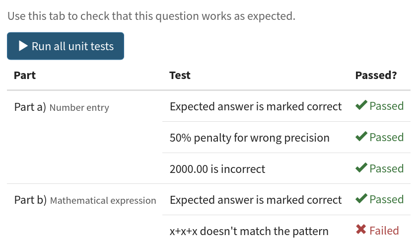

    The Testing tab, with one failed test.

The :guilabel:`Testing` tab shows the :ref:`unit tests <unit-tests>` associated with each part of the question.

You can run all the tests at once by clicking the :guilabel:`Run all unit tests` button.

If there are any errors which mean the tests can't be run, they are shown at the top of the list of tests.

Each test's status is shown in the rightmost column.

You can click on a test's name to go to its definition in the part editor.

.. access:

Access
======

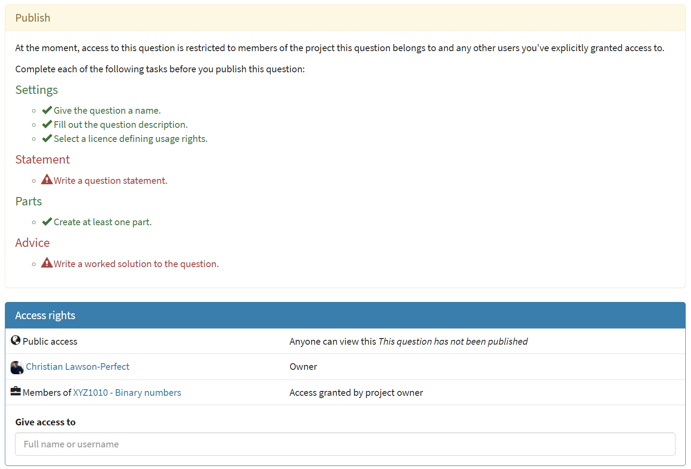

You can control who is allowed to see, and to edit, your questions.

When you create a new question, access is limited to you and any other members of the project the question belongs to.
You can grant extra access to indvidual users or *publish* your question to the public database, where it can be viewed by any other user.

Give access to a user
---------------------

Type a name into the search box to find a user. 
Click on a user's name in the results list to add them to the access list. 

Named users can have the following rights:

.. glossary::

    Can view this
        The named user can see, but not edit, this question.

    Can edit this
        The named user can see this question and make changes to it.

Access Links
------------

The URLs in this section automatically grant access to whoever follows them. 
You could use these links to share a question with someone who hasn't yet created an account on the editor, or to share a question with a group of people without inviting each person individually.

.. warning::
    These URLs grant access to whoever clicks on them, so be careful about how they're shared.

Exams using this question
=========================

A list of links to each of the exams which contain this question, for convenience.

.. _question-other-versions:

Other versions
==============

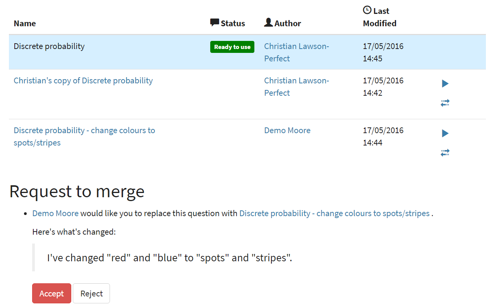

In this tab you can see all questions which are related to this one. 
Questions are related if one is a copy of the other, or they are both copies of a common ancestor.
You can use this tab to compare the current question with related versions, and offer to merge your version of the question into another.

Click on the :guilabel:`Compare` link to go to a screen where you can offer to replace the other version with your version, or vice versa.
If you have editing access to the destination question, you can replace it with the other version automatically.
If you don't have editing access, the owner of the question will be sent a *Request to merge*, which they must accept before the questions are merged.

Before creating the request, you'll be asked to describe how your version differs from the one you want to replace.
Try to sum up all your changes - this will show up in the question's editing history if your request is accepted.

.. warning::
    If the question you want to replace has changed since you made a copy of it, those changes will be lost if the request to merge is accepted - the question is completely overwritten with the new version. 

    You can always restore an old version of an question after a merge, by clicking on the appropriate :guilabel:`restore` link in the :guilabel:`Editing history` tab.

Active requests to merge other versions into the current question are shown underneath the list of related versions.
You can :guilabel:`accept` the request, in which case your version will be replaced with the other version, or :guilabel:`reject` it, in which case your version will be unchanged and the person who made the request will be notified that it was rejected.

.. _question-editing-history:

Editing history
===============

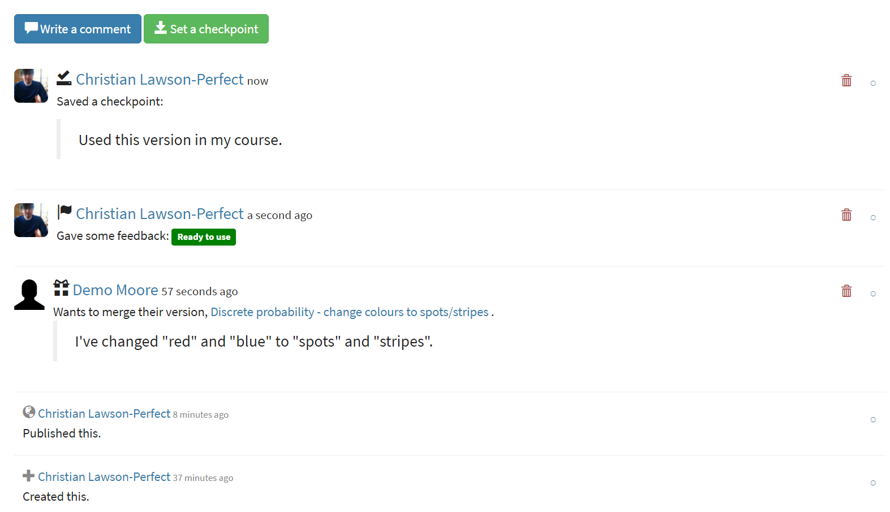

Use this tab to keep a record of changes made to your question.
Write comments to discuss problems or suggested changes.

The :guilabel:`Contributors` list shows everyone who has made a change to this question.
This list is included with the question when you :term:`download` it, and if you re-upload this question to an instance of the Numbas editor.

Each time you make a change to an question, it's saved to the database. 
To save a snapshot of the current state of the question, click the :guilabel:`Set a checkpoint` button.
You'll be asked to write a description of the question as it stands - describe what you've changed since the last snapshot, and why you're making a snapshot.

To restore a checkpoint, click its :guilabel:`Restore` button. 
The current state of the question will be overwritten with the saved state.

Other activity on this question will also be shown in this tab: for example, each time somebody uses the :guilabel:`Feedback` button to provide feedback on this question, an entry is added to the editing history.
