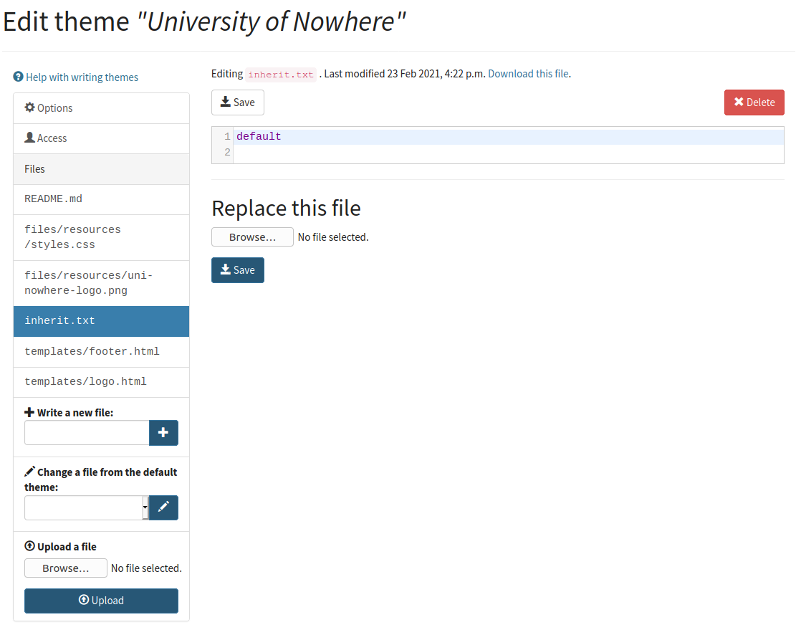

.. _themes:

Themes
======

A Numbas theme is a package of files containing everything needed to display an exam in the browser. 
This includes an HTML file, CSS stylesheets, and JavaScript to manage coordination between the page and the exam runtime.

Creating a theme in the editor
------------------------------

Go to your profile page, then click :guilabel:`Themes`.
Click :guilabel:`Create a new theme from scratch`, and give your theme a name.

You will then be presented with the editor for the theme's files.

A new theme begins with a few files:

* :file:`README.md` - a text file in `Markdown <https://www.markdownguide.org/>`_ format to document what your theme is for and how it works.
* :file:`inherit.txt` - this specifies that the theme extends the default theme.
* :file:`files/resources/style.css` - a CSS stylesheet which sets the CSS variables used by the default theme, since the most common use for custom themes is to change the colour scheme.

You can add a new file to your theme by writing a filename in the :guilabel:`Write a new file` box or uploading a file in the :guilabel:`Upload a file` box.

There is also a list of files in the default theme, under :guilabel:`Change a file from the default theme`.
Selecting one of these files will copy it into your theme, ready to be edited.

Here's a screencast showing how to create a new theme with a customised logo, colour scheme, and page footer:

.. raw:: html
    
    <iframe src="https://player.vimeo.com/video/515825444" width="640" height="337" frameborder="0" allow="autoplay; fullscreen; picture-in-picture" allowfullscreen></iframe>

Access
------

A theme you create is initially only available to you.
You can grant access to other named users under the :guilabel:`Access` tab in the theme editor.

You can give other users the ability to *view* your theme, which will allow them to use the theme in their own exams, or the ability to *edit*, which will also allow them to edit the theme's source code.

Uploading a theme to the editor
-------------------------------

Package your theme's files into a .zip file. 
Next, go to the Numbas editor and click on the :guilabel:`Profile` link, then :guilabel:`Themes`. 
The :guilabel:`Upload a new theme` takes you to a form where you can upload the .zip file you created, and give it a human-readable name. 
You will be able to select any of your themes in the exam edit page.

If you make changes to your theme, go back to the :guilabel:`Themes` page and click on the :guilabel:`Edit` link, then upload a revised .zip file.

..  Commented out until we re-record

    This screencast gives a quick summary of a theme package's contents, then shows how to create a theme which replaces the Numbas logo.

    .. raw:: html
        
        <iframe src="https://player.vimeo.com/video/167118466" width="640" height="360" frameborder="0" webkitallowfullscreen mozallowfullscreen allowfullscreen></iframe>

Contents of a theme
-------------------

A theme is a folder containing the following three things:

* An optional file called ``inherit.txt`` containing the name of a theme to extend.
* A folder called ``files`` containing static files to be included in the compiled exam. 
  For a theme which does not extend another, this contains at the minimum a JavaScript file ``files/scripts/display.js``.
* A folder called ``templates`` containing, at the least, two files, called ``templates/index.html`` and ``templates/question.xslt``.
  These files are `jinja2 <http://jinja.pocoo.org/>`_ templates which will produce the HTML for the exam and the XSLT stylesheet for questions, respectively.

.. note:: 

    Before Numbas 2.1, the files ``index.html`` and ``question.xslt`` were static, with ``index.html`` residing in the ``files`` folder, and ``question.xslt`` residing in a folder called ``xslt``. 
    For backwards compatibility, if either of these files are found in those paths, they're used instead of any template files. 
    This way, if an old-style theme extends the ``default`` theme and overrides ``index.html``, it will still work.

JavaScript and CSS files
************************

All JavaScript and CSS files used by a Numbas exam are collected into two files, ``scripts.js`` and ``styles.css``. 
These are the only files you need to load from your theme's ``index.html`` - all script and stylesheet files, including those provided by your theme, are collected into these.

HTML and XSLT templates
-----------------------

The files ``index.html`` and ``question.xslt`` are produced using `jinja2 <http://jinja.pocoo.org/>`_.
The main reason for this is to allow authors to override sections of the layout, while inheriting the rest from the base theme.

While jinja2 is a very powerful templating language, it's used in the default theme solely as a way of including sub-templates with the ```` tag.
However, if you wish to do something more sophisticated, the variables ``exam`` and ``options`` are available in the template context.
See the `Numbas compiler source code <https://github.com/numbas/Numbas/blob/master/bin/numbas.py>`_ to find out what properties these objects have.

Building off an existing theme
------------------------------

At the top of your theme folder, place a file called ``inherit.txt`` containing the name of the theme to extend, e.g. ``default``.
When an exam is compiled using your theme, all of the parent theme's files will be included, and then all of the files belonging to your theme, overriding any files of the same name from the parent theme.

For example, to change the logo displayed in the navigation bar, you could create a theme containing only ``inherit.txt`` and ``templates/logo.html``.

The default theme is packaged with the Numbas compiler; if you want to modify it you should first download the Numbas repository from https://github.com/numbas/Numbas and copy the folder ``themes/default``.
It's a good idea to remove from your theme package any files that you don't change from the default, so that bugfixes in the base theme will be carried through to your version.
