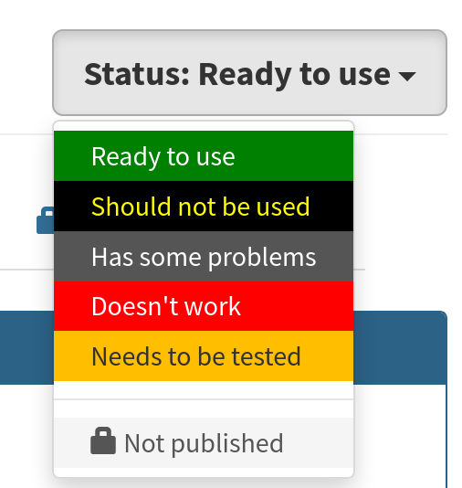
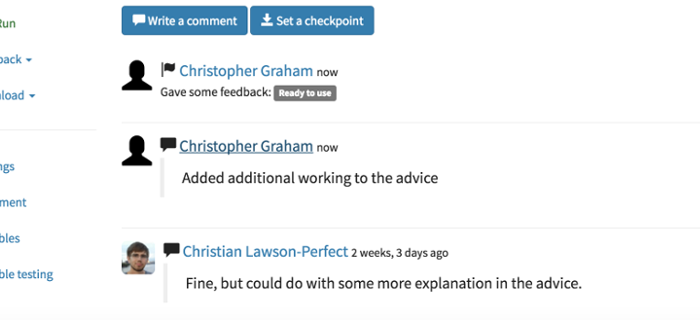
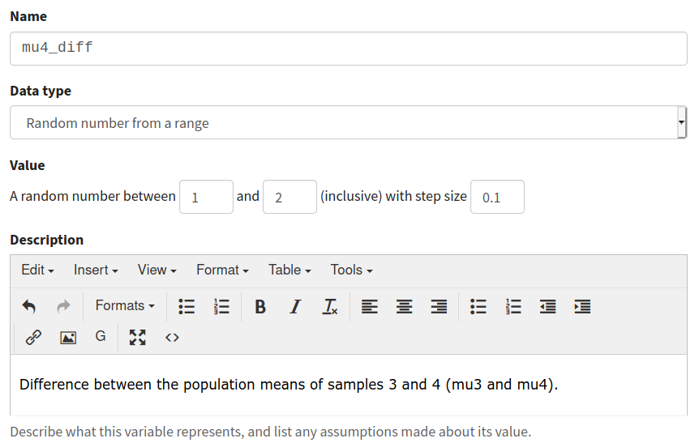

.. _collaboration:

Collaborating using Numbas
==========================

Numbas has several features to make collaborating with colleagues easier. 

Gather material in projects
---------------------------

:ref:`Projects <projects>` grant automatic editing access to their members.

Rather than granting editing access to each of your colleagues for each item you're collaborating on, organise all the material inside a project and add your colleagues as members.
Every member of the project will be able to see and give feedback on all the material.

Use the project timeline, and the editing history tab on individual items, to keep track of changes you and your colleagues make.
Write comments to discuss changes or problems.

Give feedback
-------------

Use the :ref:`feedback stamps <question-stamps>` to tell your colleagues which of your questions are ready to use, and which need more attention.

It's a good idea to have someone else test a question once it's complete; they should proofread the text and then attempt the question, giving both correct and incorrect answers to check that the marking works as intended. 

If a colleague makes a copy of a question and you decide to use that instead, mark the original version as "Should not be used" to avoid confusion later on.

When it's time to compile an exam, every question in it should be labelled "Ready to use". 
That way, you know there won't be any problems when your students take the exam.

Pull requests
-------------

If you see a problem in someone else's question but don't have editing access, make a copy and fix it, but don't just leave the original to languish - create a :ref:`pull request <question-other-versions>` so your changes can be merged back into the original.

Use the editing history tab
---------------------------

Each time you make a change to a question, :ref:`set a checkpoint <question-editing-history>` to save a snapshot of your question when you make a change.
Write an informative description of the current state of the question, and what you've changed since the last restore point.

This is useful when you're editing your own questions, but doubly so when editing other people's - they can quickly see what's different, and decide if they're happy with the changes.

You can write comments on the editing history. 
Use this to suggest changes, report bugs, and so on.

Give feedback on quality
------------------------

Add descriptions to variables and use sensible names
----------------------------------------------------

Short variable names are quick to type, but not easy to understand. 
Try to avoid single-letter variable names as much as possible, and prefer longer names over shorter ones. 
For example, it isn't immediately obvious what ``sm`` represents, while ``sample_mean`` is very clear.

In addition, make sure to write a description of each variable in the box under its definition. 
You should explain what the variable represents, and also describe any important points about how the variable is generated, or what values it can take.

Tag questions
-----------------

Use tags to categorise your questions. 
Agree with your colleagues how to tag questions - if everyone makes up their own tags, they're no use at all!

Here are some tagging schemes you might want to use:

* By topic - tag a question with the part of the curriculum it covers, separately from the name of the particular course you're making it for, so colleagues teaching other courses can find it.
* By level - use a tag to tell other authors which age range or ability level your question is suitable for.
