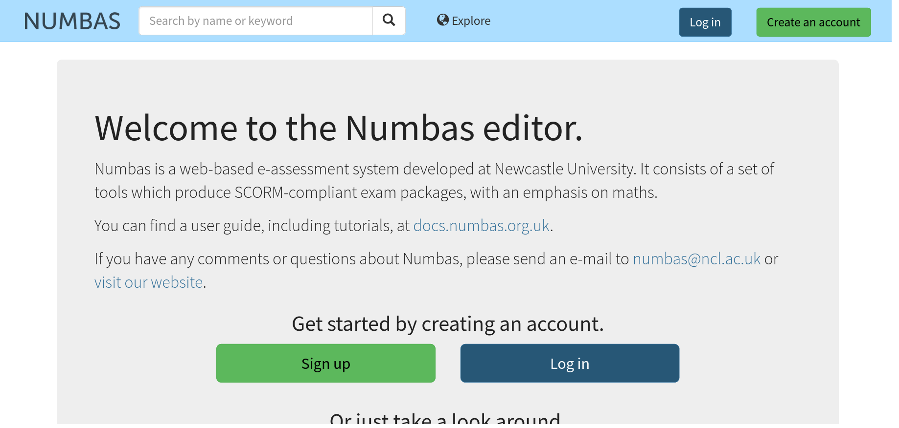
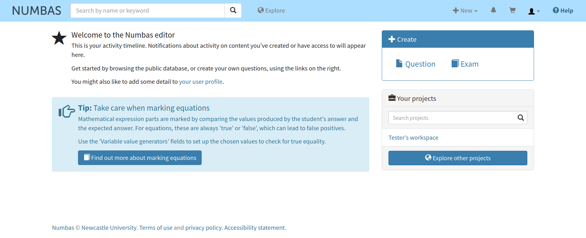

.. _signup:

Create an account
-----------------

Click on the :guilabel:`create an account` button at the top right of the page.

After filling in your details and pressing :guilabel:`Register`, you will be sent an email with a link to verify your email address. 
When you've opened that link, you can log in: click on the :guilabel:`Log in` button at the top right of the page and enter the username and password you chose.

Getting Started
###############

Once you have logged in you will be prompted to take a look at these tutorials. 
When you are ready to get started using the editor, click on the :guilabel:`Home` button to navigate to your home page.

On the left you will find your activity timeline.
This will display notifications about activity on content that you have either created or have access to.

On the right you will find buttons to create a question or exam and to browse the public database.

At the bottom of the right column you will find a list of projects of which you are a member.
You will already have a project of your own which will be the default home for your questions and exams.
