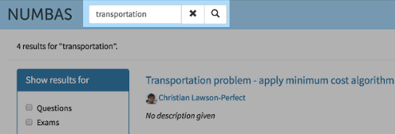
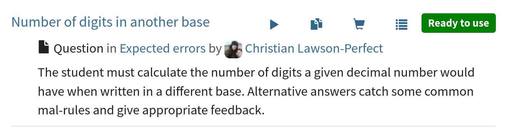
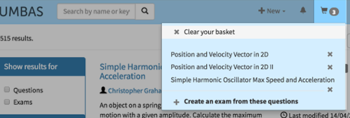
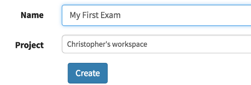
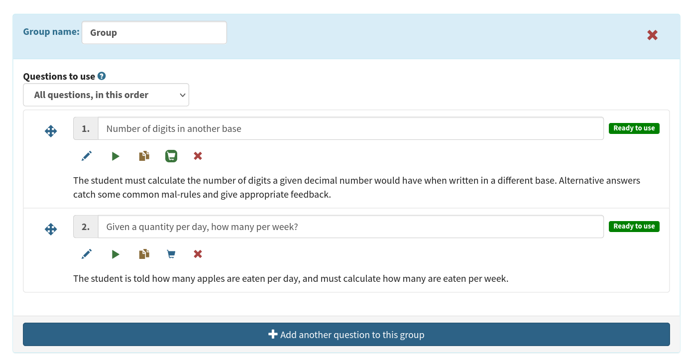
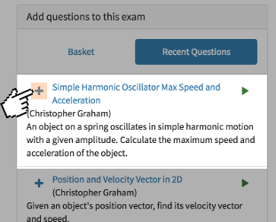
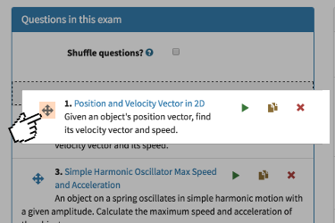

.. _create-exam:

Create an exam
--------------

Let's create an exam using questions already in the database. 

Creating an exam using existing questions
#########################################

On your home page, use the search box at the top of the page to search for content you are interested in. You can leave the search box blank to get all available questions. You can use the options on the left to filter the results. 

Once you have found a question that you are interested in, click on the :guilabel:`Test run` icon to try it out. 
If you are happy with the question, click on the :guilabel:`basket` icon to add it to your *question basket*. 

Once you've collected a few questions, click on the :guilabel:`basket` icon at the top of the page, and then click :guilabel:`Create an exam from these questions`.
You'll be taken to the editing page for your new exam.

Enter a name in the text box.
Below is a drop-down list of projects that the exam can be assigned to.
By default it will be added to your personal project.

Once created, you can  try out your exam straight away.
Click the :guilabel:`Run` link in the sidebar on the left. 
The compiled exam will open in a new window and you can have a go at answering the questions.

.. image:: screenshots/exam_edit_testrun.png
    :alt: The :guilabel:`Run` button on the exam editor is highlighted.

Once you have tried out the exam, close its window and return to the exam editor.
Consider adding some text to the description field.
The description should be short -- one or two lines -- and will appear underneath the exam's name in the exam listing page.

Adding more questions to your exam
##################################

On the editing page for your exam, under :guilabel:`Questions` select :guilabel:`Add another question to this group'.

The :guilabel:`Recent questions` tab shows questions you have recently edited.
The :guilabel:`Basket` tab shows questions you've added to your basket: you can browse the question editor to find questions, add them to your basket, and then go back to the exam editing page and add them in.

You can click on any question's name to open it in a new window. This is useful to verify that the question contains content that you find relevant before including it in your exam.

Click the plus icon on one of the question results to add it to your exam - this returns you to the main :guilabel:`Questions` page where you can rearrange your questions. 

You can drag and drop questions in the list to reorder them.

The changes that you make to the exam content are active immediately. You can see how your exam looks by clicking on :guilabel:`Run` again.

Publish your exam
#################

Once you're happy with your exam, why not publish it the public database so others can use it?
Before you can publish an exam, you must fill out the metadata fields so others can find it easily:

* Give the exam a name.
* Write a description.
* Select a licence under which others can use your exam. 
  Make sure this doesn't conflict with the licence attached to your exam's questions.
* Your exam must contain at least one question.

Once you've filled out the required fields, click on the :guilabel:`Access` tab, and then click :guilabel:`Publish`.
Your exam will now be included when anyone searches the public database.
