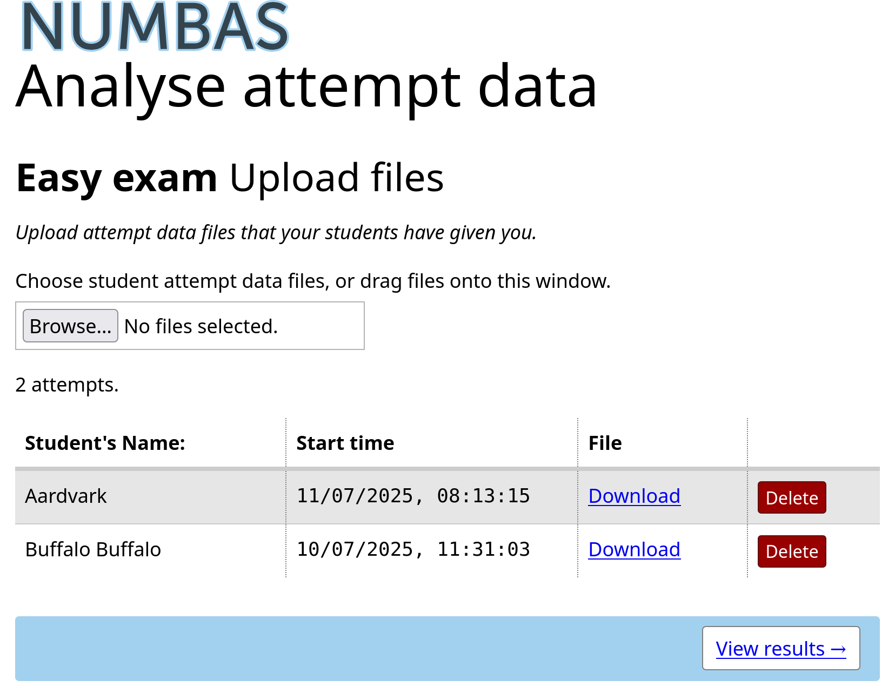
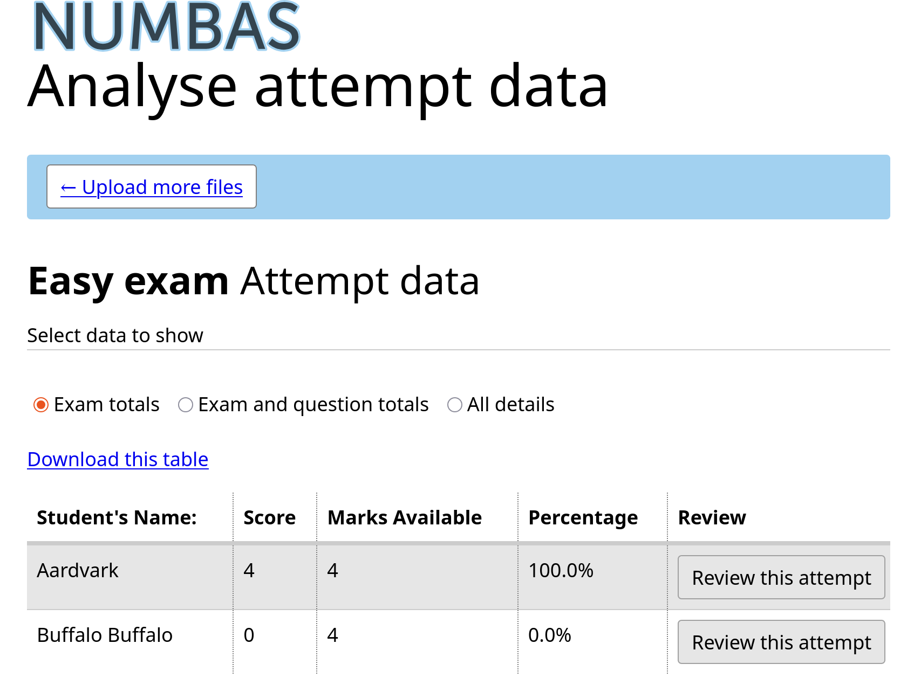

.. _deliver-to-students:

Delivering a Numbas exam to your students
-----------------------------------------

Once you've created an exam, you need a way for your students to access it.

The following instructions describe how to make an exam available to your
students, either standalone with an embed code, or through your VLE (virtual
learning environment) so you can record scores.

Run standalone on the web
=========================

Numbas exams can run entirely standalone: students access the test through a web browser, but data about their attempt is not automatically saved. 

You can allow students to download their attempt data and send it to you for processing without a VLE. 

This is also suitable when you want to provide material for students to practice on their own, and don't need to record scores.

Direct link via the Numbas editor
#################################

When you :guilabel:`Run` the exam, the :guilabel:`Share` button at the top of the page allows you to share a link to the exam, either in browser or requiring the :ref:`Numbas Lockdown app <lockdown-app>`.
You can share this URL with your students, or link to it from your course material.

To create a link to launch the exam in the Numbas lockdown app you must give a password.
Students must enter this password in order to open the link.

Students must `install the Numbas lockdown app <http://www.numbas.org.uk/lockdown-app/>`__ in order to use this link.

Embed from the editor
#####################

If you use `OEmbed <https://oembed.com/>`_-compatible software such as WordPress, you can paste the URL of the exam into the editor and it'll be embedded automatically.

Upload to your own webspace
###########################

In the exam editor, click on the :guilabel:`Download` button, and select :guilabel:`standalone .zip (no SCORM)` to download a package suitable for standalone use on the web.

Extract the zip file on your computer, and then upload the resulting files to a new directory on your webspace.
Most often you'll be able to do this through an FTP client - ask your server administrator.

Once you've uploaded the exam files, you're done! The exam will be available at the address you uploaded it to.

.. _offline-analysis:

Obtaining students' results without a VLE
#########################################

You can obtain students' attempt data, including scores and their answers, by turning on the :term:`Allow the student to download their attempt data?` option in the :guilabel:`Navigation` tab. 

Each student must, after ending their exam, download their data by clicking the :guilabel:`Download your exam data` button, and send this to you. 

This will provide a ``.txt`` file with an encoding of their exam data.
This file contains a header with basic information, followed by their encrypted data which looks like random characters.

To view this exam data, click the :guilabel:`Analyse attempt data` link under the :guilabel:`Organisation` :ref:`admin control <exam-admin-controls>` in the exam editor.

Upload all of the attempt data files by selecting them with the file chooser or by dragging them onto the page.

Click the :guilabel:`View results` button to see the data for the uploaded attempts.

There are three different views for student data:

Exam totals
    Shows the students' total marks and their percentage total.

Exam and question totals
    Shows the students' scores for each question as well as the exam total.

All details
    Shows the students' scores and answers for each question part.

Each view can be downloaded as a file in ``.csv`` format which can be used with programs such as Microsoft Excel.

Uploading an exam to a virtual learning environment
===================================================

Numbas produces SCORM objects which can be uploaded to any SCORM 2004-compatible VLE (virtual learning environment), or the `Numbas LTI provider <https://docs.numbas.org.uk/lti/>`_.

The Numbas LTI provider offers many features over a standard SCORM player, but needs to be installed locally.

If your VLE offers a built-in SCORM player, you can use it for Numbas exams without any further setup.

The first step for either method is to create a SCORM package of your exam.

Creating a SCORM package
########################

In the exam editor, click the :guilabel:`Download` button and select :guilabel:`SCORM package`.

.. image:: screenshots/scorm_download.png
    :alt: The "download" admin control in the exam editor is highlighted.

A .zip file containing everything needed to run the exam will be downloaded to your computer.

.. _upload-to-lti-provider:

Uploading to the Numbas LTI provider
####################################

See the `Numbas LTI provider documentation <https://docs.numbas.org.uk/lti/en/latest/instructor/resources.html#creating-a-new-resource>`_.

Uploading to Blackboard
#######################

.. note::

    Many users have reported problems with Blackboard's built-in SCORM player, including a consistent pattern of losing data on 5-10% of all attempts.
    We don't recommend using Blackboard's SCORM player for high-stakes assessments.
    Instead, if you can, use the :ref:`Numbas LTI provider <upload-to-lti-provider>` with Blackboard.

.. todo:: Redo this screencast

.. raw:: html

    <iframe src="https://player.vimeo.com/video/167121013" width="640" height="360" frameborder="0" webkitallowfullscreen mozallowfullscreen allowfullscreen></iframe>

Log in to Blackboard, and go to the content section of the relevant course. 
Click on the :guilabel:`Content package (SCORM)` item under the :guilabel:`Build Content` menu.

.. image:: screenshots/blackboard_content.png
    :alt: Blackboard's "Build Content" drop-down, with "Content package (SCORM)" highlighted.

On the next screen, select the .zip file you downloaded earlier, then click :guilabel:`Submit`.

.. image:: screenshots/blackboard_upload.png
    :alt: Uploading a SCORM package to Blackboard.

On the next screen you can set some options for your exam.

.. image:: screenshots/blackboard_edit.png
    :alt: Editing a SCORM package on Blackboard.

The default options are usually fine, but you should make sure that the settings under :guilabel:`SCORM availability` in particular are how you want them.

.. image:: screenshots/blackboard_availability.png
    :alt: The SCORM availability options.

Click :guilabel:`Submit`, and your exam is ready to use!

Uploading to Moodle
###################

.. raw:: html

    <iframe src="https://player.vimeo.com/video/167123387" width="640" height="360" frameborder="0" webkitallowfullscreen mozallowfullscreen allowfullscreen></iframe>

Log in to Moodle, and go to the relevant course.
Turn editing mode on, then click on the :guilabel:`Add an activity or resource` link and select :guilabel:`SCORM package`.

.. image:: screenshots/moodle_content.png
    :alt: Moodle's "Add an activity or resource" dialog.

Enter your exam's name in the :guilabel:`Name` field, and write a description in the field beneath.
Then drag the .zip file you downloaded earlier onto the :guilabel:`Package file` field.

.. image:: screenshots/moodle_upload.png
    :alt: Moodle's "Adding a new SCORM package" form.

Take a look at the rest of the settings on the page to make sure they're set how you want.
The default settings are usually fine, though you might like to set :guilabel:`Hide navigation buttons` to :guilabel:`Yes` to save screen space.

When you're ready, click on :guilabel:`Save and display`.
Your exam is ready to use!

Other VLEs
##########

A few other VLEs offer built-in SCORM players.
Most VLEs now support LTI - if your VLE supports LTI, use the Numbas LTI provider.
