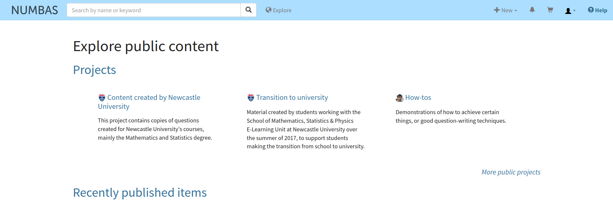
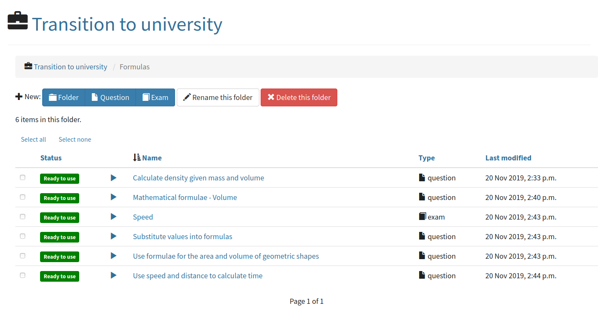
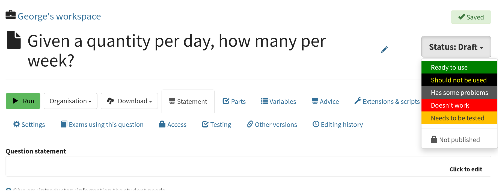
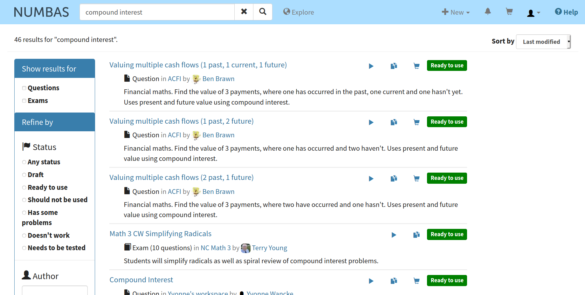

.. _explore:

Explore the editor
------------------

Once you have :ref:`created an account on the editor <signup>`, you can create your own questions and exams, as well as look at and make copies of those made by others.

Now's a good time to spend a few minutes exploring what's already available on the public database.
Click the :guilabel:`Explore` button at the top of the page.

You're shown lists of publicly available :ref:`projects <projects>`, as well as :ref:`questions <questions>` and :ref:`exams <exams>` that have been published.

    The "Explore public content" page.

Look at published projects
##########################

Click on a project's name to view its homepage.

Click on the :guilabel:`Browse this project's content` button, and have a look at the questions and exams within.
You can click the :guilabel:`Run` button (a rightward-pointing "Play" icon) to have a go at an item as if you were a student.

    Browsing a project.

Give feedback on an item
########################

While browsing the public database, bear in mind that there's no centralised quality control - you might come across published items that contain errors, or don't even work.
You can help to improve the quality of the public database by providing feedback.
If you spot a problem with an item, click the :guilabel:`Status` button at the top-right of the page, and select an appropriate feedback stamp.
If you've got time, give some more information about what's wrong by clicking the :guilabel:`Editing history` tab and writing a comment.

    Giving feedback on a question.

If you find an item that you'd be happy to use with your students, give it a :guilabel:`Ready to use` feedback stamp. 

Search for a topic you're interested in
#######################################

Use the search bar at the top of the page to search across all content you have access to, including your own material and published items.

The search isn't very sophisticated, so you might have to try a few different keywords to find what you want.

    Searching for "compound interest".
