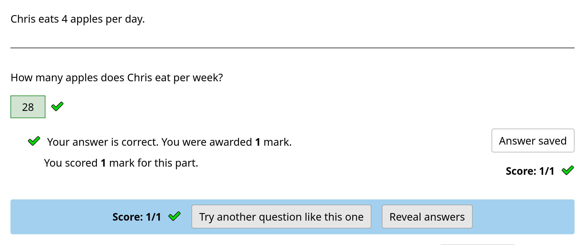

Write your first question
===========================

In this tutorial you will learn about the structure and features of a Numbas question by creating a simple numeracy problem.

To begin, let's make this question:

    Chris eats 7 apples per day. 
    How many apples does he eat per week?

Log in to the Numbas editor and, in the :guilabel:`Create` box, click on the :guilabel:`Question` link.

.. image:: screenshots/write-question/create-question.png
    :alt: The "create a question" link on the homepage is highlighted.

You will be prompted to give your question a name, and to assign it to a project.
Call the question "Given a quantity per day, how many per week?"
As this is your first question you should use the default project, which is your own workspace.

.. figure:: screenshots/write-question/name-question.png
    :alt: Screenshot of the "create a new question" form. The name field contains "Given a quantity per day, how many per week?"

    Giving the question a name.

The structure of a question
---------------------------

You are taken to the *editing page* for your new question.
It is worth spending a few moments finding your way around this page.

At the top of the page are the question's name and, above that, a link to the project which it belongs to.
Below are buttons to test run and download the question.
Below this there are options to navigate through the various steps involved in editing a question.

.. figure:: screenshots/write-question/blank-question.png
    :alt: Screenshot of the question editor.

    The question editor.

In the centre is the main editing interface.

Every Numbas question consists of three sections: :ref:`Statement <statement>`, :ref:`Parts <parts>`, and :ref:`Advice <advice>`.
In the Statement, the context for the question is given to the student.
Parts are where the student enters their answers.
A question can have one or more parts, each of which is one of several types, depending on what kind of input you want from the student.
Finally, the optional Advice section can be used to give a full solution to the question, which the student can request to see if they're stuck. 

Each of these sections of the editor can be accessed from the links in the sidebar, or you can use the buttons at the bottom of each section to guide you through in a logical order.

Planning
--------

It's important to :ref:`plan <planning-a-question>` your question before you start writing it.

In this question, we will assess whether the student can convert a quantity per day into a quantity per week.

They'll be told how many apples a person eats per day, and then be asked to write down how many apples per week the person eats.

Their answer will be marked correct if it's seven times the given number.
One way of getting a wrong answer is to divide by seven instead of multiplying by seven.

A natural way to randomise the question is to randomise the number of apples eaten per day.

Statement
---------

The statement sets the scene for the question, giving any necessary information.
It’s a rich text editor, so in addition to text you can add video, images, anything you like here.

The statement is optional, and ours is going to be very short, but let’s
go for it anyway.
Type:

    Chris eats 7 apples per day.

in the :guilabel:`Question statement` box.

.. figure:: screenshots/write-question/statement.png
   :alt: Screenshot of the question statement editor. It contains the text "Chris eats 7 apples per day."

   Writing a question statement.

Notice that you can click :guilabel:`Test run` to preview your question at any time.

If you run the question now, you'll see there is a statement, but nowhere to enter an answer.
We need to create a number entry part.

Go back to the editing window and click on :guilabel:`Parts` in the sidebar, or follow the navigation buttons at the bottom of the page, skipping past :guilabel:`Variables`, which we will consider later.

Once on the Parts page, click on the :guilabel:`Add a part` button, and select :ref:`Number entry <number-entry>`.

.. figure:: screenshots/write-question/add-part.png
   :alt: Screenshot of the interface to select a part type

   Selecting a part type.

Every part has a :term:`Prompt`, which you can use to ask the student for the particular answer the part assesses.
Type:

    How many apples does Chris eat per week?

.. figure:: screenshots/write-question/part-prompt.png
   :alt: The part prompt editor, containing the text "How many apples does Chris eat per week?"

   Filling in the prompt.

Now we need to specify the answer.
Move to the :guilabel:`Marking settings` tab.

*Number entry* parts are marked by checking if the student’s answer is within the range defined by the :term:`Minimum accepted value` and :term:`Maximum accepted value` fields.
For this question the answer is exactly :math:`49`, so put that in both fields.

.. figure:: screenshots/write-question/part-answer.png
   :alt: Screenshot of the marking settings tab. The minimum and maximum accepted value fields both contain '49'

   Specifying the correct answer.

Now press :guilabel:`Test Run` again to try out the question.

If you put ``49`` in the entry box and press :guilabel:`Submit part`, the answer is marked correct; any other number is marked incorrect.

   A preview of the question.

Variables
---------

The question works.
So what next?

The most important feature of computer-based assessment is the ability to dynamically generate questions which are different every time they are run.
In Numbas this is achieved using *variables*.

Let’s change the question so that the number of apples eaten per day is picked at random.
We do this by defining a variable in the :guilabel:`Variables` tab.

Click on the :guilabel:`Add a variable` button to add a new variable. 
Name it ``num_apples`` and select the data type 
:guilabel:`Random number from a range`.
Choose numbers between 2 and 9 with step size 1.

The :guilabel:`description` field gives you more space to describe what the variable represents.
This will be useful when you come back to the question.
Write:

    The number of apples eaten per day.

.. figure:: screenshots/write-question/variable-num-apples.png
   :alt: Screenshot of the variable editor. The name field contains "num_apples", the value reads "a random number between 2 and 9 (inclusive) with step size 1", and the description reads "The number of apples eaten per day.

   Defining the variable ``num_apples``.

The :guilabel:`Regenerate variables` button on the right will give you a preview
of the values that you can expect to be generated.

Now it’s time to replace the number 7 in the question with the new variable.
Variables can be substituted in using curly braces: ``{}``.

Change the statement to use the new variable:

    Chris eats {num_apples} apples per day.

.. figure:: screenshots/write-question/part-prompt-randomised.png
   :alt: Screenshot of the "Prompt" tab. The prompt field reads "Chris eats {num_apples} apples per day."

   Using the variable in the part's prompt.

We also need to change the expected answer, which is currently hard-coded to 49.
Go back to the :guilabel:`Marking settings` tab and change both minimum and maximum accepted value to ``7 * num_apples``.

.. figure:: screenshots/write-question/part-answer-randomised.png
   :alt: Screenshot of the "marking settings" tab. The minimum and maximum accepted value fields both contain "7 * num_apples".

   Calculating the answer based on the randomised variable.

When planning this question, we noted that the student might divide the number of apples by seven instead of multiplying.
If the number of apples per day is not a multiple of seven, this will produce a fraction, which the student should be allowed to enter.
Tick the :guilabel:`Allow the student to enter a fraction?` box.

Test run your question again. 
You can click the :guilabel:`Try another question like this one` button to 
start the question afresh, with a new value of the random variable.

Advice
------

A question should provide a full solution to help students who get stuck
or find the wrong answer.

Move to the :guilabel:`Advice` tab, and write:

    Each day, Chris eats {num_apples} apples. There are 7 days in a week.

    To find the number of apples Chris eats each week, multiply {num_apples} by 7.

    Chris eats {7*num_apples} apples per week.

Now click :guilabel:`Test Run` again; if you press the :guilabel:`Reveal answers` button at the bottom of the question page, the number input is filled in with the correct answer, and the advice text you wrote is displayed at the bottom.

You have created your first complete question! 
